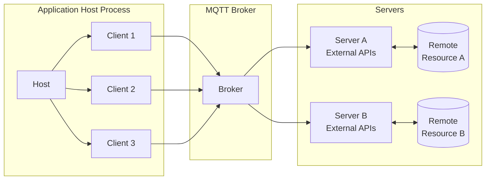
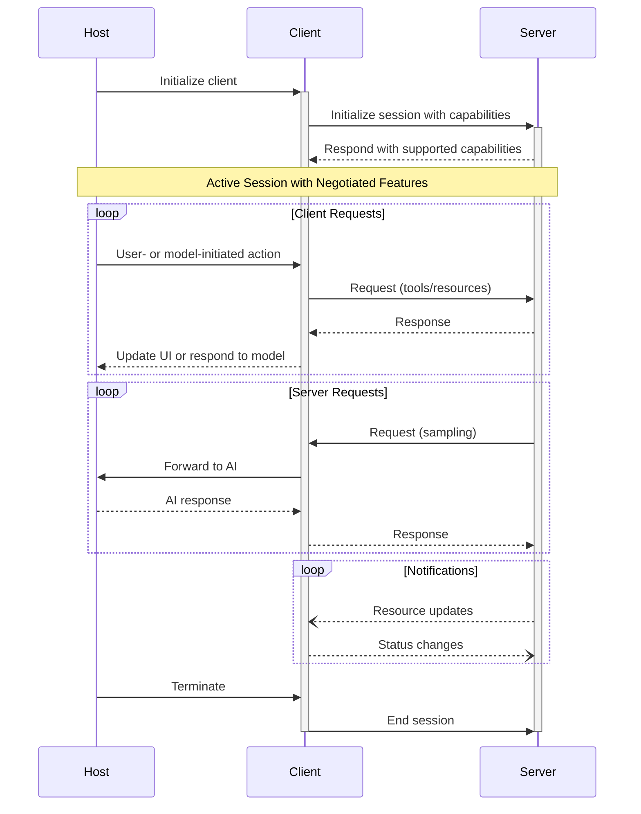


This page is modified from [MCP-Architecture](https://spec.modelcontextprotocol.io/specification/draft/architecture/) for the MQTT transport layer, modifications include:

- [Core Components]()



 **Protocol Revision**: draft 

The Model Context Protocol (MCP) follows a client-host-server architecture where each
host can run multiple client instances. This architecture enables users to integrate AI
capabilities across applications while maintaining clear security boundaries and
isolating concerns. Built on JSON-RPC, MCP provides a stateful session protocol focused
on context exchange and sampling coordination between clients and servers.

## Core Components

MCP over MQTT introduces a centralized MQTT broker, while other components remain unchanged. Additionally, an MCP Client can communicate with multiple MCP Servers through a shared MQTT connection.

### Host

The host process acts as the container and coordinator:

- Creates and manages multiple client instances
- Controls client connection permissions and lifecycle
- Enforces security policies and consent requirements
- Handles user authorization decisions
- Coordinates AI/LLM integration and sampling
- Manages context aggregation across clients

### Clients

Each client is created by the host and maintains an isolated server connection:

- Establishes one stateful session per server
- Handles protocol negotiation and capability exchange
- Routes protocol messages bidirectionally
- Manages subscriptions and notifications
- Maintains security boundaries between servers

A host application creates and manages multiple clients, with each client having a 1:1
relationship with a particular server.

### Servers

Servers provide specialized context and capabilities:

- Expose resources, tools and prompts via MCP primitives
- Operate independently with focused responsibilities
- Request sampling through client interfaces
- Must respect security constraints
- Can be local processes or remote services

## Design Principles

MCP is built on several key design principles that inform its architecture and
implementation:

1. **Servers should be extremely easy to build**

   - Host applications handle complex orchestration responsibilities
   - Servers focus on specific, well-defined capabilities
   - Simple interfaces minimize implementation overhead
   - Clear separation enables maintainable code

2. **Servers should be highly composable**

   - Each server provides focused functionality in isolation
   - Multiple servers can be combined seamlessly
   - Shared protocol enables interoperability
   - Modular design supports extensibility

3. **Servers should not be able to read the whole conversation, nor "see into" other
   servers**

   - Servers receive only necessary contextual information
   - Full conversation history stays with the host
   - Each server connection maintains isolation
   - Cross-server interactions are controlled by the host
   - Host process enforces security boundaries

4. **Features can be added to servers and clients progressively**
   - Core protocol provides minimal required functionality
   - Additional capabilities can be negotiated as needed
   - Servers and clients evolve independently
   - Protocol designed for future extensibility
   - Backwards compatibility is maintained

## Message Types

MCP defines three core message types based on
[JSON-RPC 2.0](https://www.jsonrpc.org/specification):

- **Requests**: Bidirectional messages with method and parameters expecting a response
- **Responses**: Successful results or errors matching specific request IDs
- **Notifications**: One-way messages requiring no response

Each message type follows the JSON-RPC 2.0 specification for structure and delivery
semantics.

## Capability Negotiation

The Model Context Protocol uses a capability-based negotiation system where clients and
servers explicitly declare their supported features during initialization. Capabilities
determine which protocol features and primitives are available during a session.

- Servers declare capabilities like resource subscriptions, tool support, and prompt
  templates
- Clients declare capabilities like sampling support and notification handling
- Both parties must respect declared capabilities throughout the session
- Additional capabilities can be negotiated through extensions to the protocol

Each capability unlocks specific protocol features for use during the session. For
example:

- Implemented [server features]() must be
  advertised in the server's capabilities
- Emitting resource subscription notifications requires the server to declare
  subscription support
- Tool invocation requires the server to declare tool capabilities
- [Sampling]() requires the client to declare
  support in its capabilities

This capability negotiation ensures clients and servers have a clear understanding of
supported functionality while maintaining protocol extensibility.

