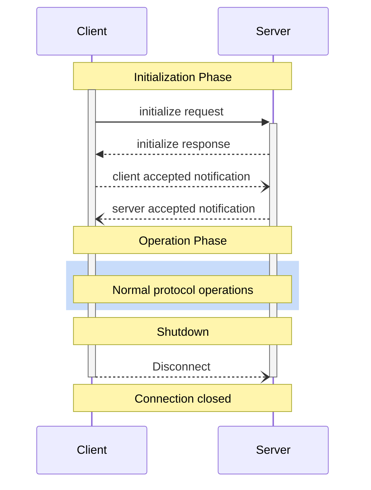
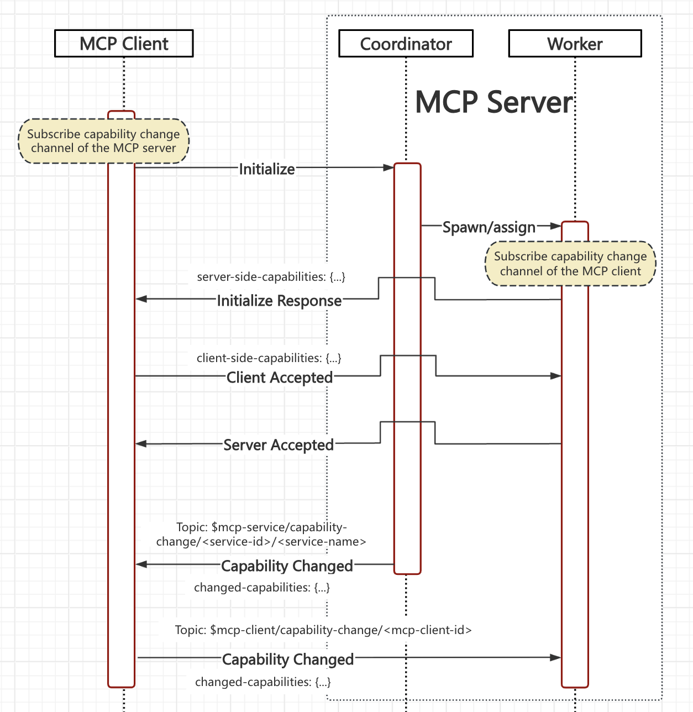


This page is modified from [MCP-Architecture](https://spec.modelcontextprotocol.io/specification/draft/basic/lifecyle/) for the MQTT transport layer, modifications include:

- Rewrite for MQTT transport


 **Protocol Revision**: draft 

The Model Context Protocol (MCP) defines a rigorous lifecycle for client-server
connections that ensures proper capability negotiation and state management.

1. **Initialization**: Capability negotiation and protocol version agreement
2. **Operation**: Normal protocol communication
3. **Shutdown**: Graceful termination of the connection



## Lifecycle Phases

### Service Discovery

After the MCP server starts, it registers its service with the MQTT Broker. The channel (MQTT topic) for service discovery and registry is: `$mcp-service/presence/<service-id>/<service-name>`.

The message payload **SHOULD** comprehensively describe the functionalities provided by the service, but to reduce the message size, it **SHOULD NOT** include overly detailed information such as function parameters. This topic **MUST** have the Retained Flag set to True, and in the CONNECT message, it **MUST** also be set as the Last Will Msg with an empty payload.

The client can subscribe to the `$mcp-service/presence/+/<service-name-filter>` topic at any time, where `<service-name-filter>` is a filter for the service name.

For example, if the client determines through its permissions that it can only access services of type `<service-type>/<sub-type>`, it can subscribe to `$mcp-service/presence/+/<service-type>/<sub-type>/#`, thereby subscribing to the service discovery channel for all services of the `<sub-type>` type at once.

Although the client can subscribe to `$mcp-service/presence/+/#` to get all types of services, the administrator might restrict it through ACL (Access Control List) on the MQTT Broker to only send and receive messages on RPC channels like `$mcp-rpc-endpoint/<mcp-client-id>/<service-type>/<sub-type>/#`. Therefore, subscribing to overly broad topics is not useful. By designing the `<service-name-filter>` appropriately, the client can reduce interference from irrelevant information.


### Initialization

The initialization phase **MUST** be the first interaction between client and server.
During this phase, the client and server:

- Establish protocol version compatibility
- Exchange and negotiate capabilities
- Share implementation details

When a client initialize the connection, the server **MUST** assign a worker connection to the client. If the server has no available worker connections, the server **MAY** create a new worker connection or reject the client connection.

If the coordinator does not support the requested protocol version, it **MUST** respond with an
error indicating the supported version(s) on the RPC channel.

If the coordinator supports the requested protocol version, it assigns a worker connection to the client and responds with its own capabilities and information, on the RPC channel. If no worker connection is available, the coordinator creates a new worker connection. If for some reason no worker connection can be used, the coordinator **MUST** respond with an error indicating the reason.


The client **MUST** initiate this phase by sending an `initialize` request containing:

- Protocol version supported
- Client implementation information

```json
{
  "jsonrpc": "2.0",
  "id": 1,
  "method": "initialize",
  "params": {
    "protocolVersion": "2024-11-05",
    "clientInfo": {
      "name": "ExampleClient",
      "version": "1.0.0"
    }
  }
}
```

The server **MUST** respond with its own capabilities and information:

```json
{
  "jsonrpc": "2.0",
  "id": 1,
  "result": {
    "protocolVersion": "2024-11-05",
    "capabilities": {
      "logging": {},
      "prompts": {
        "listChanged": true
      },
      "resources": {
        "subscribe": true,
        "listChanged": true
      },
      "tools": {
        "listChanged": true
      }
    },
    "serverInfo": {
      "name": "ExampleServer",
      "version": "1.0.0"
    }
  }
}
```

After successful initialization, on the RPC channel, the client **MUST** send an `accepted` notification
to indicate it has accepted the negotiation, and is ready to begin normal operations. The notification **MUST** include the client's capabilities:

```json
{
  "jsonrpc": "2.0",
  "method": "notifications/accepted",
  "params": {
    "capabilities": {
      "roots": {
        "listChanged": true
      },
      "sampling": {}
    }
  }
}
```

If the server accepts the capabilities, on the RPC channel, the server worker **MUST** send an `accepted` notification to indicate it has accepted the negotiation, and is ready to begin normal operations:

```json
{
  "jsonrpc": "2.0",
  "method": "notifications/accepted"
}
```

- The client **SHOULD NOT** send requests other than
  [pings]() before receiving
  the `accepted` notification.
- The server **SHOULD NOT** send requests other than
  [pings]() and
  [logging]() before receiving
  the `accepted` notification.

#### Version Negotiation

In the `initialize` request, the client **MUST** send a protocol version it supports.
This **SHOULD** be the _latest_ version supported by the client.

If the server supports the requested protocol version, it **MUST** respond with the same
version. Otherwise, the server **MUST** respond with another protocol version it
supports. This **SHOULD** be the _latest_ version supported by the server.

If the client does not support the version in the server's response, it **SHOULD**
disconnect.

#### Capability Negotiation

Client and server capabilities establish which optional protocol features will be
available during the session.

Key capabilities include:

| Category | Capability     | Description                                                                                  |
| -------- | -------------- | -------------------------------------------------------------------------------------------- |
| Client   | `roots`        | Ability to provide filesystem [roots]()       |
| Client   | `sampling`     | Support for LLM [sampling]() requests      |
| Client   | `experimental` | Describes support for non-standard experimental features                                     |
| Server   | `prompts`      | Offers [prompt templates]()                 |
| Server   | `resources`    | Provides readable [resources]()           |
| Server   | `tools`        | Exposes callable [tools]()                    |
| Server   | `logging`      | Emits structured [log messages]() |
| Server   | `experimental` | Describes support for non-standard experimental features                                     |

Capability objects can describe sub-capabilities like:

- `listChanged`: Support for list change notifications (for prompts, resources, and
  tools)
- `subscribe`: Support for subscribing to individual items' changes (resources only)

### Capability Update

After the MCP Client negotiates capabilities with the MCP Server Worker, both parties cache each other's capability lists. Then, they obtain updated capabilities by subscribing to each other's capability update topics.

Before initiating the Initialize request, the MCP Client must subscribe to the MCP Server's capability update topic: `$mcp-service/capability-change/+/<service-name-filter>`, where `<service-name-filter>` is a filter for the service name.

For example, during the service discovery phase, if a service named `<service-type>/<sub-type>/<name>` is available, the client can subscribe to `$mcp-service/capability-change/+/<service-type>/<sub-type>/#`, thereby subscribing to the capability update channel for all services of the `<sub-type>` type at once.

The MCP Server Worker first subscribes to the client's capability update channel: `$mcp-client/capability-change/<mcp-client-id>`. Then, in the Initialize Response message, it carries the server's complete capability information.

Finally, the MCP Client includes its complete capability information in its Accepted message.

If there are subsequent capability updates:

- The client sends the updated capability to: `$mcp-client/capability-change/<mcp-client-id>`

- The server (Coordinator) will send the updated capability to: `$mcp-service/capability-change/<service-id>/<service-name>`



### Operation

During the operation phase, the client and server exchange messages according to the
negotiated capabilities.

Both parties **SHOULD**:

- Respect the negotiated protocol version
- Only use capabilities that were successfully negotiated

### Shutdown

The worker **MUST** connect with a will message to notify the client when it disconnects unexpectedly.

When a client disconnects, the server worker **MUST** disconnect and its resources.

Before a worker connection disconnects, the worker **MUST** send a "disconnected" notification to the client it serves.

When the client receives the disconnection notification, it **MAY** send another initialization request to the coordinator connection to get a new worker connection.

The message format for the "disconnected" notification is:

```json
{
  "jsonrpc": "2.0",
  "method": "notifications/disconnected"
}
```

## Error Handling

Implementations **SHOULD** be prepared to handle these error cases:

- Protocol version mismatch
- Failure to negotiate required capabilities
- Worker connection creation failure
- Initialize request timeout
- Shutdown timeout

Implementations **SHOULD** implement appropriate timeouts for all requests, to prevent
hung connections and resource exhaustion.

Example initialization error:

```json
{
  "jsonrpc": "2.0",
  "id": 1,
  "error": {
    "code": -32602,
    "message": "Unsupported protocol version",
    "data": {
      "supported": ["2024-11-05"],
      "requested": "1.0.0"
    }
  }
}
```
