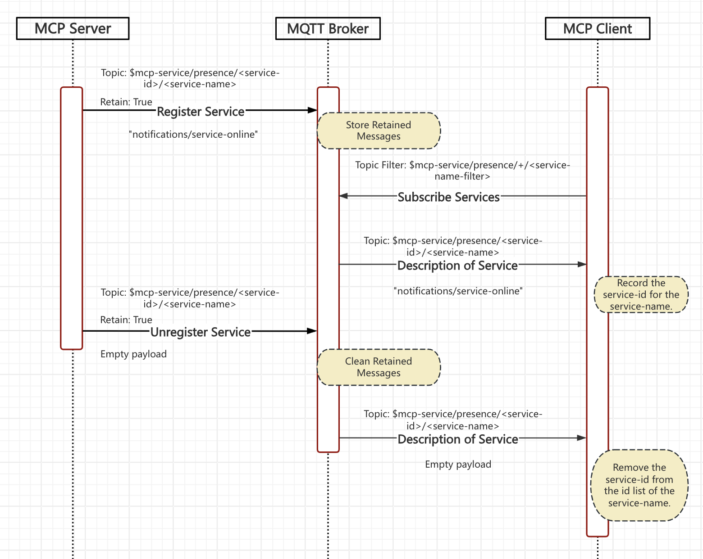
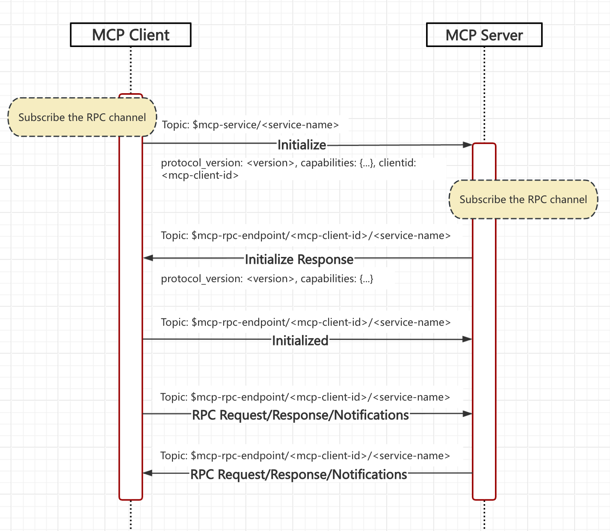
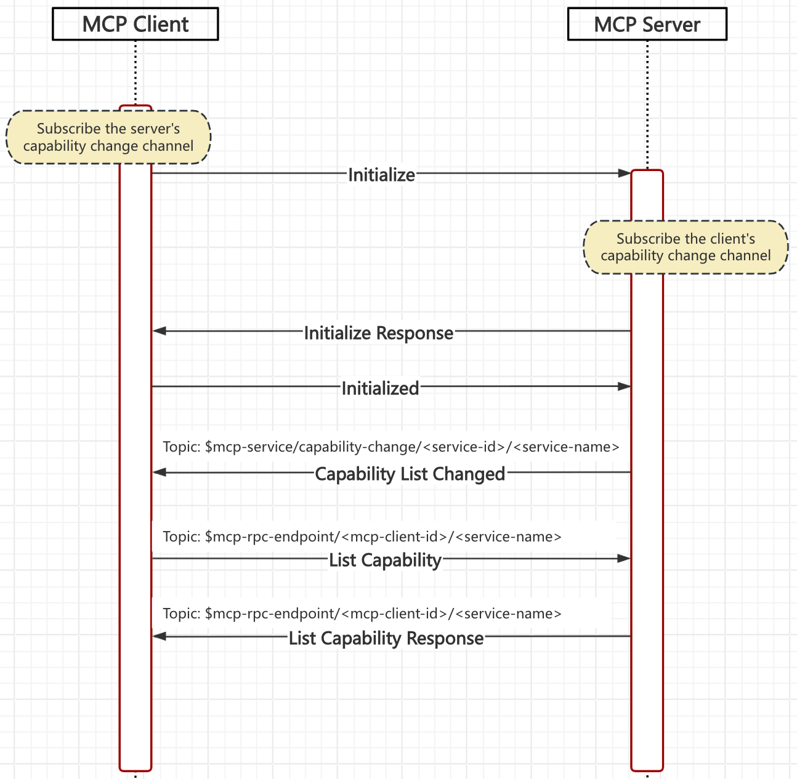
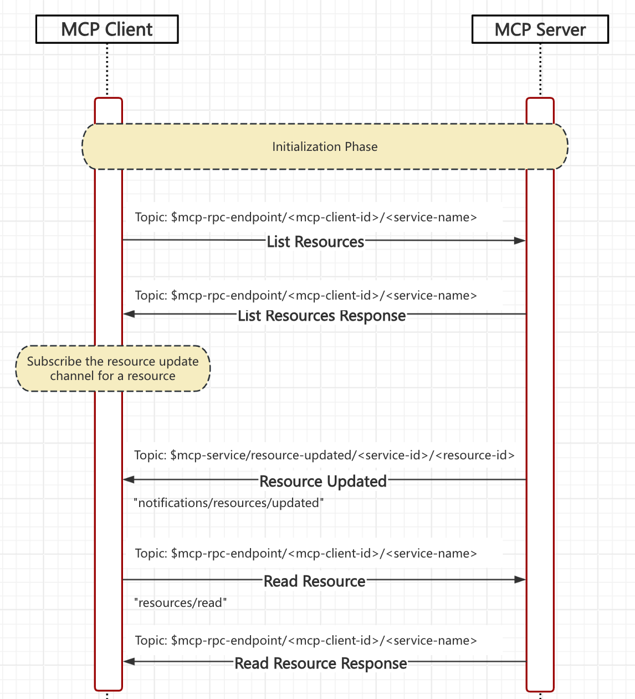


This page is modified from [MCP-Lifecycle](https://spec.modelcontextprotocol.io/specification/draft/basic/lifecycle/) for the MQTT transport layer, modifications include:

- Rewrite for MQTT transport


 **Protocol Revision**: draft 

The Model Context Protocol (MCP) defines a rigorous lifecycle for client-server
connections that ensures proper capability negotiation and state management.

1. **Initialization**: Capability negotiation and protocol version agreement
2. **Operation**: Normal protocol communication
3. **Shutdown**: Graceful termination of the connection


## Service Discovery

### Service Registration

After the MCP server starts, it registers its service with the MQTT broker. The presence channel (MQTT topic) for service discovery and registration is: `$mcp-service/presence/<service-id>/<service-name>`.

The MCP server **MUST** publish a "service/online" notification to the service presence channel when they start, with the **RETAIN** flag set to `True`.

The "service/online" notification **SHOULD** provide only limited information about the service to avoid excessive message size:

- A brief description of the service's functionality to help clients determine which services they need to call.
- Some metadata, such as hints about the permissions required to access this service, to help clients quickly assess whether they have access.

```json
{
  "jsonrpc": "2.0",
  "method": "notifications/service/online",
  "params": {
      "description": "This is a brief description about the functionalities provided by this service to allow clients to choose as needed. If tools are provided, it explains which tools are available but does not include tool parameters to reduce message size.",
      "metadata": {}
  }
}
```

More detailed information, such as parameter details of the tools, **SHOULD** only be included in the capability message when the client initializes the service.

The client can subscribe to the `$mcp-service/presence/+/<service-name-filter>` topic at any time, where `<service-name-filter>` is a filter for the service name.

For example, if the service name is `<service-type>/<sub-type>/<name>`, and the client determines through its permissions that it can only access services of type `<service-type>/<sub-type>`, it can subscribe to `$mcp-service/presence/+/<service-type>/<sub-type>/#`, thereby subscribing to the service presence channel for all services of the `<sub-type>` type at once.

Although the client can subscribe to `$mcp-service/presence/+/#` to get all types of services, the administrator might restrict it through ACL (Access Control List) on the MQTT broker to only send and receive messages on RPC channels like `$mcp-rpc-endpoint/<mcp-client-id>/<service-type>/<sub-type>/#`. Therefore, subscribing to overly broad topics is not useful. By designing the `<service-name-filter>` appropriately, the client can reduce interference from irrelevant information.

### Service Unregistration

Before disconnecting, the server needs to send an empty payload message to the `$mcp-service/presence/<service-id>/<service-name>` topic to clear the registration information.

When connecting to the MQTT broker, the server must set `$mcp-service/presence/<service-id>/<service-name>` as the will topic, with an empty payload will message, to clear the registration information in case of an unexpected disconnection.

On the `$mcp-service/presence/<service-id>/<service-name>` topic:

- When the client receives a `service/online` notification, it should record the `<service-id>` as one of the instances of that `<service-name>`.
- When the client receives an empty payload message, it should clear the cached `<service-id>`. As long as any instance of that `<service-name>` is online, the client should consider the service to be online.



## Initialization

The initialization phase **MUST** be the first interaction between client and server.
During this phase, the client and server:

- Establish protocol version compatibility
- Exchange and negotiate capabilities
- Share implementation details

If the server does not support the requested protocol version, it **MUST** respond with an
error indicating the supported version(s) on the RPC channel.

The client **MUST** subscribe to the RPC channel (`$mcp-rpc-endpoint/<mcp-client-id>/<service-name>`) before sending the initialization request, with the **No Local** subscription option.

The server **MUST** subscribe to the RPC channel (`$mcp-rpc-endpoint/<mcp-client-id>/<service-name>`) before responding to the initialization request, with the **No Local** subscription option.



The client **MUST** initiate this phase by sending an `initialize` request to the topic `$mcp-service/<service-name>` containing:

- Protocol version supported
- Client capabilities
- Client implementation information

```json
{
  "jsonrpc": "2.0",
  "id": 1,
  "method": "initialize",
  "params": {
    "protocolVersion": "2024-11-05",
    "capabilities": {
      "roots": {
        "listChanged": true
      },
      "sampling": {}
    },
    "clientInfo": {
      "name": "ExampleClient",
      "version": "1.0.0"
    }
  }
}
```

The `initialize` request **MUST** include an MQTT user property `mcp-client-id` to identify the client:

- **mcp-client-id**: The client's MQTT client ID

The server **MUST** respond with its own capabilities to the topic `$mcp-rpc-endpoint/<mcp-client-id>/<service-name>` and information:

```json
{
  "jsonrpc": "2.0",
  "id": 1,
  "result": {
    "protocolVersion": "2024-11-05",
    "capabilities": {
      "logging": {},
      "prompts": {
        "listChanged": true
      },
      "resources": {
        "subscribe": true,
        "listChanged": true
      },
      "tools": {
        "listChanged": true
      }
    },
    "serverInfo": {
      "name": "ExampleServer",
      "version": "1.0.0"
    }
  }
}
```

After successful initialization, the client MUST send an initialized notification to indicate it is ready to begin normal operations:

```json
{
  "jsonrpc": "2.0",
  "method": "notifications/initialized"
}
```

- The client **SHOULD NOT** send requests other than
  [pings]() before the server has responded to the initialize request.
- The server **SHOULD NOT** send requests other than
  [pings]() and
  [logging]() before receiving
  the `initialized` notification.

### Version Negotiation

In the `initialize` request, the client **MUST** send a protocol version it supports.
This **SHOULD** be the _latest_ version supported by the client.

If the server supports the requested protocol version, it **MUST** respond with the same
version. Otherwise, the server **MUST** respond with another protocol version it
supports. This **SHOULD** be the _latest_ version supported by the server.

If the client does not support the version in the server's response, it **SHOULD**
disconnect.

### Capability Negotiation

Client and server capabilities establish which optional protocol features will be
available during the session.

Key capabilities include:

| Category | Capability     | Description                                                                                  |
| -------- | -------------- | -------------------------------------------------------------------------------------------- |
| Client   | `roots`        | Ability to provide filesystem [roots]()       |
| Client   | `sampling`     | Support for LLM [sampling]() requests      |
| Client   | `experimental` | Describes support for non-standard experimental features                                     |
| Server   | `prompts`      | Offers [prompt templates]()                 |
| Server   | `resources`    | Provides readable [resources]()           |
| Server   | `tools`        | Exposes callable [tools]()                    |
| Server   | `logging`      | Emits structured [log messages]() |
| Server   | `experimental` | Describes support for non-standard experimental features                                     |

Capability objects can describe sub-capabilities like:

- `listChanged`: Support for list change notifications (for prompts, resources, and
  tools)
- `subscribe`: Support for subscribing to individual items' changes (resources only)

## Capability Update

Before initiating the Initialize request, the MCP client **MUST** subscribe to the MCP server's capability update topic: `$mcp-service/capability-change/+/<service-name-filter>`, where `<service-name-filter>` is a filter for the service name.

For example, during the service discovery phase, if a service named `<service-type>/<sub-type>/<name>` is available, the client can subscribe to `$mcp-service/capability-change/+/<service-type>/<sub-type>/#`, thereby subscribing to the capability update channel for all services of the `<sub-type>` type at once.

Before the MCP server responds to the initialization request, it **MUST** first subscribe to the MCP client's capability update topic: `$mcp-client/capability-change/<mcp-client-id>`.

If there are subsequent capability list updates:

- The server will send a notification to: `$mcp-service/capability-change/<service-id>/<service-name>`
- The client will send a notification to: `$mcp-client/capability-change/<mcp-client-id>`

The payload of the capability update notification depends on the specific capability that has changed. For example "notifications/tools/list_changed" for tools. After receiving a capability list change notification, the client or server needs to retrieve the updated capability list. See the specific capability documentation for details.



## Resource Update

The MCP protocol specifies that the client can subscribe to changes of a specific resource.

After the initialization is complete, if the server has resources, the client will use the "resources/list" RPC call to obtain the complete list of resources. If the server provides the capability to subscribe to resources, the client can specify the resource ID to subscribe to changes of that resource.

The topic for the client to subscribe to resource changes is: `$mcp-service/resource-update/<service-id>/<resource-id>`.

When a resource changes, the server **SHOULD** send a notification to `$mcp-service/resource-update/<service-id>/<resource-id>`, where the `<resource-id>` is the ID of the resource that has changed.

See [resources subscriptions](/docs/specification/draft/server/resources/#subscriptions) for more details.



## Operation

During the operation phase, the client and server exchange messages according to the
negotiated capabilities.

Both parties **SHOULD**:

- Respect the negotiated protocol version
- Only use capabilities that were successfully negotiated

## Shutdown

### Server Disconnect

The server **MUST** connect with a will message to notify the client when it disconnects unexpectedly, the will topic is `$mcp-service/presence/<service-id>/<service-name>` and the payload is empty.

Before a server disconnects, the server **MUST** send a empty message to the topic `$mcp-service/presence/<service-id>/<service-name>`.

When the client receives the empty message on the channel, **MUST** disconnect and **MAY** send another initialization request using a different client-id.

### Client Disconnect

The server **MUST** subscribe to the client's presence channel (`$mcp-client/presence/<mcp-client-id>`) before sending the initialization response.

The client **MUST** connect with a will message to notify the server when it disconnects unexpectedly, the will topic is `$mcp-client/presence/<mcp-client-id>` and the payload is a "disconnected" notification.

Before the client disconnects, it **MUST** send a "disconnected" notification to the topic `$mcp-client/presence/<mcp-client-id>`.

After the server receives the "disconnected" notification, it **MUST** unsubscribe the `$mcp-rpc-endpoint/<mcp-client-id>/<service-name>` topic.

The message format for the client's "disconnected" notification is:

```json
{
  "jsonrpc": "2.0",
  "method": "notifications/disconnected"
}
```

## Health Checks

The client or the server **MAY** send `ping` requests to the server at any time to check the health of their counterpart.

- If the client does not receive a `ping` response from the server within a reasonable time, it **MUST** send a "disconnected" notification to the topic `$mcp-client/presence/<mcp-client-id>` and disconnect itself.
- If the server does not receive a `ping` response from the client within a reasonable time, it **MUST** send any other PRC requests to the client.

For more information, see the [Ping]().

## Timeouts

All RPC requests are sent asynchronously via MQTT messages, so timeout issues need to be considered. The timeout duration may vary for different RPC requests, but it should be configurable.

Below are the recommended default timeout values for each type of RPC request in this protocol:

- "initialize": 30 seconds
- "ping": 10 seconds
- "roots/list": 30 seconds
- "resources/list": 30 seconds
- "tools/list": 30 seconds
- "prompts/list": 30 seconds
- "prompts/get": 30 seconds
- "sampling/createMessage": 60 seconds
- "resources/read": 30 seconds
- "resources/templates/list": 30 seconds
- "resources/subscribe": 30 seconds
- "tools/call": 60 seconds
- "completion/complete": 60 seconds
- "logging/setLevel": 30 seconds


Progress requests are sent as notifications and do not require a response, so no timeout is needed.


## Error Handling

Implementations **SHOULD** be prepared to handle these error cases:

- Protocol version mismatch
- Failure to negotiate required capabilities
- Initialize request timeout
- Shutdown timeout

Implementations **SHOULD** implement appropriate timeouts for all requests, to prevent
hung connections and resource exhaustion.

Example initialization error:

```json
{
  "jsonrpc": "2.0",
  "id": 1,
  "error": {
    "code": -32602,
    "message": "Unsupported protocol version",
    "data": {
      "supported": ["2024-11-05"],
      "requested": "1.0.0"
    }
  }
}
```
