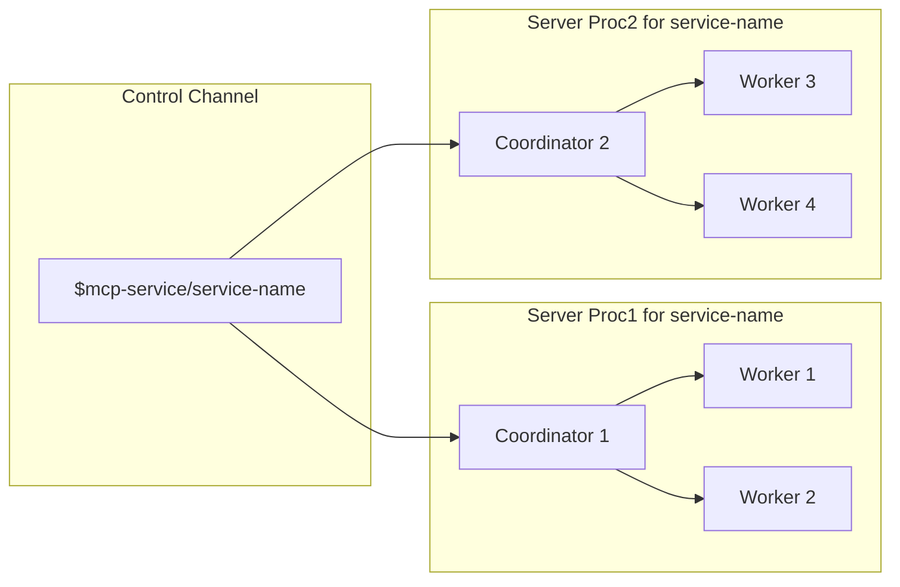
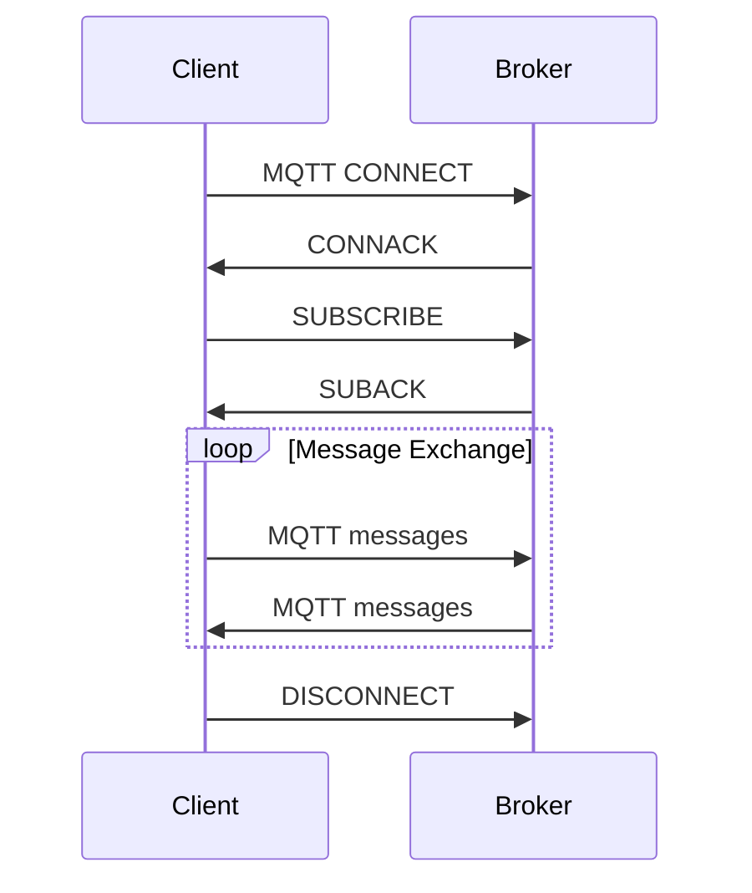


This page is modified from [MCP-Transport](https://spec.modelcontextprotocol.io/specification/draft/basic/transports/) for the MQTT transport layer, modifications include:

- Rewrite for MQTT transport


 **Protocol Revision**: draft 

# The MQTT Transport for MCP

This protocol defines the MQTT transport mechanism for client-server communication.

MCP uses JSON-RPC to encode messages. JSON-RPC messages **MUST** be UTF-8 encoded.

## Terminology

- **service-name**: The service name of the MCP Server, which will be included in the topic.

  Multiple MCP Servers with the same `service-name` provide exactly the same service. When the client sends an initialize message, the Broker will select one of them according to a shared subscription strategy.

  Multiple MCP Servers with different `service-name`s may still provide similar functions. In this case, when the client sends an initialize message, it needs to choose one based on its permissions or strategy.

  `service-name` can be any string. It is recommended to use a hierarchical topic style separated by `/` so that the client can subscribe to a certain type of service using MQTT topic wildcards, for example: `service-type/sub-type/name`.

- **service-name-filter**: The topic filter to match the `service-name`.

- **service-id**: The MQTT Client ID of the MCP Server. Any string except `/`. It must be globally unique and will also be included in the topic.

- **resource-id**: The resource ID identifies a resource that the server is managing. Any string except `/`. It must be unique within the service.

- **mcp-client-id**: The MQTT Client ID of the client. Any string except `/`. It must be globally unique and will be included in the topic.

## Coordinators and Workers of MCP Server

In the **MQTT** transport, the server operates as an independent process (or a pool of processes for load balancing purpose) that can handle multiple client connections.

The server **MUST** establish 2 kinds of MQTT connections:

1. **Coordinator Connection**: Each server process needs to maintain an MQTT connection as a Coordinator to receive client initialization requests, create and manage worker connections, and send notifications specific to this process, such as capability change notifications, when the server's capabilities change.
2. **Worker Connection**: Each server process needs to maintain one or more MQTT connections as workers to receive client RPC message requests, send message responses, and send notifications specific to this worker, such as worker disconnection notifications.

This allows us to achieve high availability and linear scalability on the server side: each MCP Server can start multiple service processes, with each process's Coordinator sharing a subscription to the "control channel" and waiting for client initialization requests.  

When scaling up, existing MCP Clients remain connected to the old service processes, while new MCP Clients have the opportunity to initiate initialization requests to the new service processes.  

When scaling down, established RPC channels are interrupted, causing MCP Clients to re-initiate initialization requests to the MCP Server, thereby connecting to another service process.

# MQTT Requirements and Conventions

## Message Channels (Topics) 

MCP over MQTT transmits messages through MQTT topics, where each MQTT topic is referred to as a "channel". This protocol includes the following message channels:  

| Channel Name                    | Topic Name                                            | Description |
|---------------------------------|-------------------------------------------------------|-------------|
| Server's Control Channel          | `$mcp-service/<service-name>`                         | Used for sending and receiving initialization messages and other control messages. |
| Server's Capability Change Channel| `$mcp-service/capability-change/<service-id>/<service-name>` | Used for sending and receiving server capability list changed notification. |
| Server Resource Update Channel | `$mcp-service/resource-update/<service-id>/<resource-id>` | Used for sending and receiving server resource updated notification. |
| Server's Presence Channel | `$mcp-service/presence/<service-id>/<service-name>`   | Used for sending and receiving server online/offline status messages. |
| Client's Presence Channel | `$mcp-client/presence/<mcp-client-id>`   | Used for sending and receiving server online/offline status messages. |
| Client's Capability Change Channel| `$mcp-client/capability-change/<mcp-client-id>`       | Used for sending and receiving client capability list changed notification. |
| RPC Channel                     | `$mcp-rpc-endpoint/<mcp-client-id>/<service-name>`    | Used for sending and receiving RPC requests, RPC responses, and notification messages. |

## MQTT Version

The server and client **MUST** use MQTT version 5.0.

## QoS

The QoS level for all messages **MUST** be 1.

## MQTT Client ID

### Server Coordinator

The Client ID of the Coordinator can be any string except `/`, referred to as `service-id`.

### Server Worker

The Client ID of the Worker is `<service-id>:<ID>`, where `<service-id>` is the Client ID of the Coordinator, and `<ID>` can be any string except `/`.

### MCP Client

The Client ID of the MCP Client, referred to as `mcp-client-id`, can be any string except `/`.

## MQTT Topics and Topic Filters

### Topic Filters that MCP Server Subscribes to

| Subscriber         | Topic Filter                                         | Explanation |
|-------------------|----------------------------------------------------|-------------|
| Server Coordinator | `$share/any/$mcp-service/<service-name>`          | The control channel of the MCP server to receive control plane messages. We use shared subscription to force a message only goes to exactly one coordinator. |
| Server Worker | `$mcp-client/capability-change/<mcp-client-id>`   | The client’s capability change channel to receive capability list changed notification of the clients. |
| Server Worker      | `$mcp-rpc-endpoint/<mcp-client-id>/<service-name>`   - Set `No Local` option | The RPC channel to receive RPC requests, RPC responses, and notifications from a client. |

### Topics that MCP Server Publishes to

| Publisher          | Topic Name                                            | Messages |
|-------------------|------------------------------------------------------|----------|
| Server Coordinator | `$mcp-service/capability-change/<service-id>/<service-name>` | capability changed notification.|
| Server Coordinator | `$mcp-service/presence/<service-id>/<service-name>`   - RETAIN Flag: true   - Also set as a will topic with empty payload to clear the retain message when offline | Presence messages for the MCP Server.   See [ServiceDiscovery](/docs/specification/draft/basic/lifecycle#service-discovery) for more details |
| Server Coordinator | `$mcp-service/resource-update/<service-id>/<resource-id>` | Resource update notification.|
| Server Worker      | `$mcp-rpc-endpoint/<mcp-client-id>/<service-name>`   - Set as a will topic with the payload to the `disconnected` notification | RPC requests, responses and notifications. |

### Topics that MCP Client Subscribes to
| Subscriber | Topic Filter                                         | Explanation |
|------------|------------------------------------------------------|-------------|
| Client     | `$mcp-service/capability-change/+/<service-name-filter>` | The capability change channel to receive capability list changed notification of the service. |
| Client     | `$mcp-service/resource-update/+/<resource-id>` | The resource update channel to receive resource update notification of the service. |
| Client     | `$mcp-service/presence/+/<service-name-filter>`      | The service presence channel to receive the presence message of the service. |
| Client     | `$mcp-rpc-endpoint/<mcp-client-id>/<service-name-filter>`   - Set `No Local` option | The RPC channel to receive PRC requests, responses and notifications sent by the MCP server. |

### Topics that MCP Client Publishes to

| Publisher | Topic Name                                         | Messages |
|-----------|---------------------------------------------------|----------|
| Client    | `$mcp-service/<service-name>`                     | Send control plane messages like initialize. |
| Client    | `$mcp-client/capability-change/<mcp-client-id>`   | Send client capability list changed notification |
| Client    | `$mcp-rpc-endpoint/<mcp-client-id>/<service-name>` | The RPC channel to send RPC requests/responses to a specific server. |

## MQTT Authentication and Authorization

When the MCP client and server connect to the MQTT broker, they **MUST** authenticate using the method required by the broker.

When subscribing and publishing messages, the MCP client and server **MUST** comply with the permissions defined by the broker for the topic.

## MQTT Message Flow

For each MCP Client, MCP Server Coordinator and MCP Server Worker:

For more details about the message flow, see [Lifecycle](lifecycle.md).

