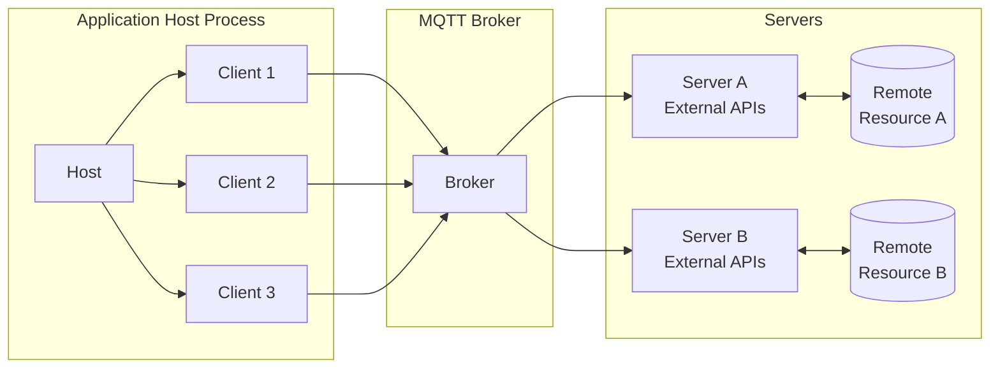
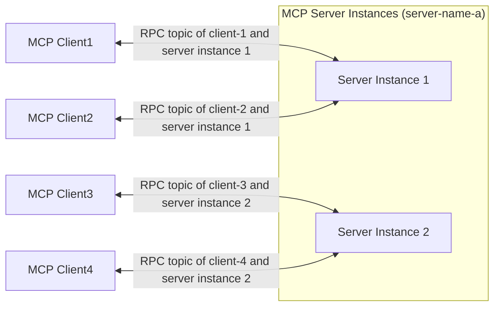

# Architecture

## Core Components of the MQTT Transport

MCP over MQTT introduces a centralized MQTT broker, while other components (Hosts, Clients, Servers) remain unchanged.

### Host, Client, and Server

The Host, Client, and Server components remain unchanged:

- The host process acts as the container and coordinator of the clients.
- Each client is created by the host and maintains an isolated server connection.
- Servers provide specialized context and capabilities.

With the exception that the clients and servers communicate with the MQTT broker instead of directly with each other.

See [Core Components](https://spec.modelcontextprotocol.io/specification/2025-03-26/architecture/#core-components)

### MQTT Broker

The MQTT broker acts as a centralized message router:
- Facilitates communication between clients and servers.
- Support service discovery and service registration (via retained messages).
- Authenticates and authorizes clients and servers.

## Server Side Load Balancing and Scalability

To achieve MCP server-side load balancing and scalability, an MCP server can start multiple instances (processes), each using a unique `server-id` as the MQTT Client ID to establish an independent MQTT connection. All instances of an MCP server share the same `server-name`.

The client must first subscribe to the service discovery topic to obtain the list of `server-id`s for a specific `server-name`. Then, based on a client-defined server selection strategy (e.g., random selection or round-robin), it initiates an `initialize` request to one of the `server-id`s. After initialization is complete, the MCP client communicates with the selected MCP server instance on a specific RPC topic.

This allows us to achieve high availability and scalability on the MCP server side:

- When scaling up, existing MCP clients remain connected to the old server instances, while new MCP clients have the opportunity to initiate initialization requests to the new server instances.

- When scaling down, MCP clients could re-initiate initialization requests to the MCP server, thereby connecting to another server instance.
