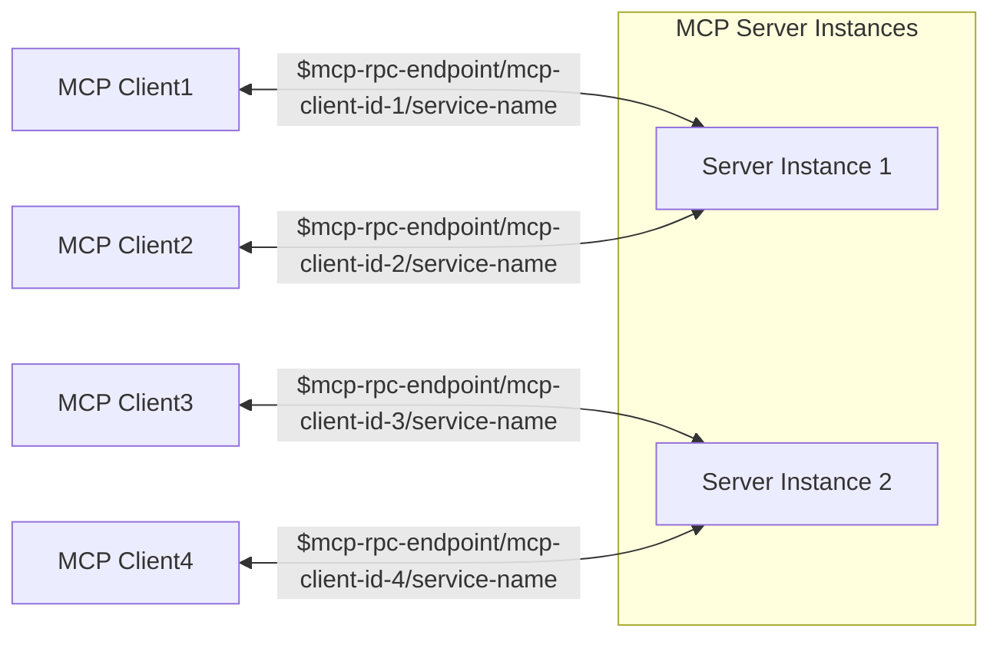
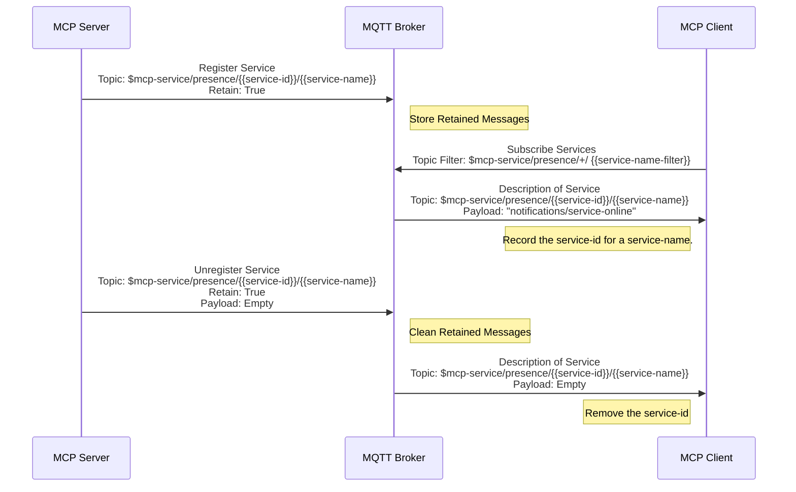
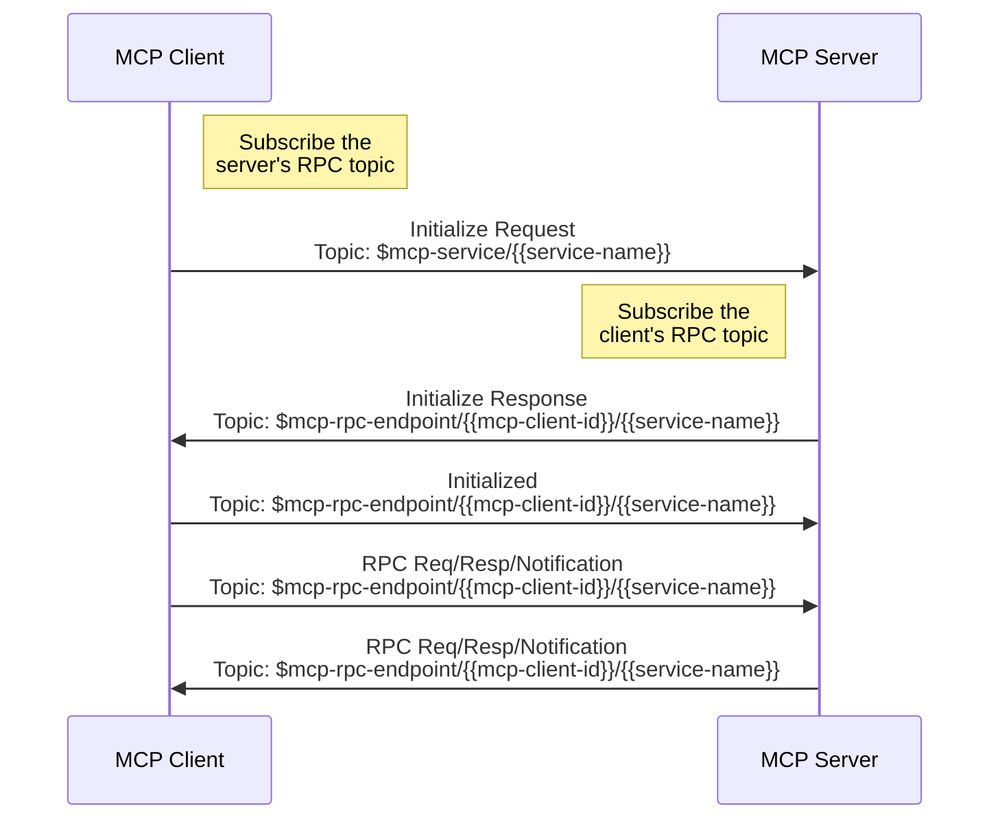
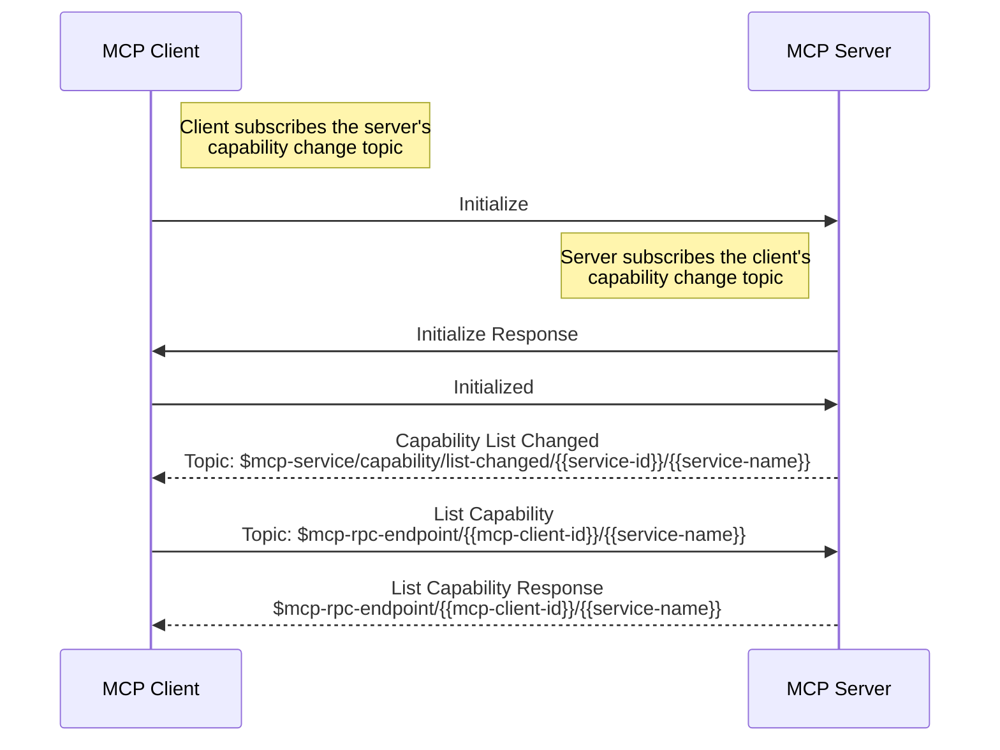
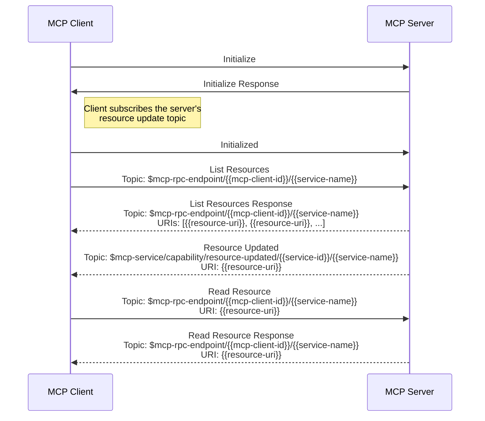

# The MQTT Transport for MCP

This protocol defines the MQTT transport mechanism for client-server communication.

MCP uses JSON-RPC to encode messages. JSON-RPC messages **MUST** be UTF-8 encoded.

## Terminology

- **service-name**: The service name is the identifier of a MCP server, which will be included in the topic.

  Multiple MCP servers with the same `service-name` provide exactly the same service. When the MCP client sends an initialize message, it should select one of them according to a client-side determined strategy.

  Multiple MCP Servers with different `service-name`s may still provide similar functions. In this case, when the client sends an initialize message, it should select one of them to establish a connection as needed. The selection criteria can be based on the client's permissions, recommendations from a large model, or the user's choice.

  The `service-name` must be a hierarchical topic style separated by `/` so that the client can subscribe to a certain type of service using MQTT topic wildcards, for example: `service-type/sub-type/name`.

  The `service-name` should not `+` and `#` characters.

  The `service-name` should be unique among all MCP servers.

- **service-name-filter**: The MQTT topic filter to match the `service-name`, it may include `/`, `+` and `#` characters. See descriptions about **service-name** for more details.

- **service-id**: The MQTT Client ID of a MCP server instance. Any string except `/`, `+` and `#`. It must be globally unique and will also be included in the topic.

- **mcp-client-id**: The MQTT Client ID of the client. Any string except `/`, `+` and `#`. It must be globally unique and will be included in the topic. Each time an initialization request is made, a different client-id must be used. It is recommended to use a hex string UUID.

## Architecture

To achieve MCP server-side load balancing and scalability, the MCP server can start multiple instances (processes), each using a unique `service-id` as the MQTT Client ID to establish an independent MQTT connection.

The client must first subscribe to the service discovery topic to obtain the list of `service-id`s for a specific `service-name`. Then, based on a custom client strategy (e.g., random selection or round-robin), it initiates an initialization request to one of the `service-id`s.

For details on the corresponding topic name of the topic, refer to the [message topics](#message-topics) section.



This allows us to achieve high availability and scalability on the MCP server side, each MCP server can start multiple instances (processes):

- When scaling up, existing MCP clients remain connected to the old server processes, while new MCP clients have the opportunity to initiate initialization requests to the new server processes.

- When scaling down, MCP clients could re-initiate initialization requests to the MCP server, thereby connecting to another server process.

# MQTT Requirements and Conventions

## Message Topics

MCP over MQTT transmits messages through MQTT topics. This protocol includes the following message topics:  

| Topic Name                       | Topic Name                                                             | Description                                                                        |
| -------------------------------- | ---------------------------------------------------------------------- | ---------------------------------------------------------------------------------- |
| Server's Control Topic           | `$mcp-service/{{service-name}}`                                        | Used for sending and receiving initialization messages and other control messages. |
| Server's Capability Change Topic | `$mcp-service/capability/list-changed/{{service-id}}/{{service-name}}` | Used for sending and receiving server capability list changed notification.        |
| Server Resource Update Topic     | `$mcp-service/capability/resource-updated/{{service-id}}`              | Used for sending and receiving server resource updated notification.               |
| Server's Presence Topic          | `$mcp-service/presence/{{service-id}}/{{service-name}}`                | Used for sending and receiving server's online/offline status messages.            |
| Client's Presence Topic          | `$mcp-client/presence/{{mcp-client-id}}`                               | Used for sending and receiving client's online/offline status messages.            |
| Client's Capability Change Topic | `$mcp-client/capability/list-changed/{{mcp-client-id}}`                | Used for sending and receiving client capability list changed notification.        |
| RPC Topic                        | `$mcp-rpc-endpoint/{{mcp-client-id}}/{{service-name}}`                 | Used for sending and receiving RPC requests/responses, and notification messages.  |

## MQTT Protocol Version

The MCP server and client **MUST** use MQTT Protocol version 5.0.

## QoS

The QoS level for all messages **MUST** be 1.

## Session Expiry Interval

The session expiry interval **MUST** be set to 0, meaning the session will be cleaned up when the client disconnects.

## MQTT Client ID

### MCP Server

The Client ID of the MCP server can be any string except `/`, `+` and `#`, referred to as `service-id`.

### MCP Client

The Client ID of the MCP Client, referred to as `mcp-client-id`, can be any string except `/`, `+` and `#`, each time an initialization request is made, a different client-id must be used. It is recommended to use a hex string UUID.

## MQTT Topics and Topic Filters
### Topic Filters that MCP Server Subscribes to

| Topic Filter                                                                          | Explanation                                                                                              |
|---------------------------------------------------------------------------------------|----------------------------------------------------------------------------------------------------------|
| `$mcp-service/{{service-name}}`                                                       | The control topic of the MCP server to receive control messages.                                         |
| `$mcp-client/capability/list-changed/{{mcp-client-id}}`                               | The MCP client’s capability change topic to receive capability list changed notification of the clients. |
| `$mcp-client/presence/{{mcp-client-id}}`                                              | The MCP client’s presence topic to receive the disconnected notification of the clients.                 |
| `$mcp-rpc-endpoint/{{mcp-client-id}}/{{service-name}}` <br> - Set **No Local** option | The RPC topic to receive RPC requests, RPC responses, and notifications from a MCP client.               |

### Topics that MCP Server Publishes to

| Topic Name                                                                                                                                                                           | Messages                                                                                               |
| ------------------------------------------------------------------------------------------------------------------------------------------------------------------------------------ | ------------------------------------------------------------------------------------------------------ |
| `$mcp-service/capability/list-changed/{{service-id}}/{{service-name}}`                                                                                                               | capability list changed notification.                                                                  |
| `$mcp-service/presence/{{service-id}}/{{service-name}}` <br> - **RETAIN** Flag: true <br> - Also set as a **Will Topic** with empty payload to clear the retain message when offline | Presence messages for the MCP Server. <br> See [ServiceDiscovery](#service-discovery) for more details |
| `$mcp-service/capability/resource-updated/{{service-id}}`                                                                                                                            | Resource update notification.                                                                          |
| `$mcp-rpc-endpoint/{{mcp-client-id}}/{{service-name}}`                                                                                                                               | RPC requests, responses and notifications.                                                             |

### Topics that MCP Client Subscribes to

| Topic Filter                                                                                 | Explanation                                                                                    |
| -------------------------------------------------------------------------------------------- | ---------------------------------------------------------------------------------------------- |
| `$mcp-service/capability/list-changed/+/{{service-name-filter}}`                             | The capability change topic to receive capability list changed notification of the MCP server. |
| `$mcp-service/capability/resource-updated/+`                                                 | The resource update topic to receive resource update notification of the MCP server.           |
| `$mcp-service/presence/+/{{service-name-filter}}`                                            | The presence topic to receive the presence message of the MCP server.                          |
| `$mcp-rpc-endpoint/{{mcp-client-id}}/{{service-name-filter}}` <br> - Set **No Local** option | The RPC topic to receive PRC requests, responses and notifications sent by the MCP server.     |

### Topics that MCP Client Publishes to

| Topic Name                                                                                                                   | Messages                                                           |
|------------------------------------------------------------------------------------------------------------------------------|--------------------------------------------------------------------|
| `$mcp-service/{{service-name}}`  <br> - Set **User Property**, "mcp-client-id": {{MQTT-Client-ID-of-the-MCP-Client}}         | Send control messages like the initialize request.                 |
| `$mcp-client/capability/list-changed/{{mcp-client-id}}`                                                                      | Send client capability list changed notification                   |
| `$mcp-client/presence/{{mcp-client-id}}` <br> - Also set as a **Will Topic** with a disconnected notification as the payload | Send disconnected notification for the MCP client.                 |
| `$mcp-rpc-endpoint/{{mcp-client-id}}/{{service-name}}`                                                                       | The RPC topic to send RPC requests/responses to a specific server. |

# Lifecycle of MQTT Transport

## Service Discovery

### Service Registration

After the MCP server starts, it registers its service with the MQTT broker. The presence topic for service discovery and registration is: `$mcp-service/presence/{{service-id}}/{{service-name}}`.

The MCP server **MUST** publish a "service/online" notification to the service presence topic when they start, with the **RETAIN** flag set to `True`.

The "service/online" notification **SHOULD** provide only limited information about the service to avoid the message size being too large. The client can request more detailed information after initialization.

- A brief description of the MCP server's functionality to help clients determine which services they need to call.
- Some metadata, such as hints about the permissions required to access this MCP server, to help clients quickly assess whether they have access.

```json
{
  "jsonrpc": "2.0",
  "method": "notifications/service/online",
  "params": {
      "description": "This is a brief description about the functionalities provided by this MCP server to allow clients to choose as needed. If tools are provided, it explains what tools are available but does not include tool parameters to reduce message size.",
      "meta": {
        // Any metadata, such as hints about the permissions required to access this MCP server
        "authorization": {
          "roles": ["admin", "user"]
        }
      }
  }
}
```

More detailed information, such as parameter details of the tools, **SHOULD** only be fetched by the client when needed, by sending `**/list` requests to the server.

The client can subscribe to the `$mcp-service/presence/+/{{service-name-filter}}` topic at any time, where `{{service-name-filter}}` is a filter for the service name.

For example, if the service name is `{{service-type}}/{{sub-type}}/{{name}}`, and the client determines through its permissions that it can only access services of type `{{service-type}}/{{sub-type}}`, it can subscribe to `$mcp-service/presence/+/{{service-type}}/{{sub-type}}/#`, thereby subscribing to the service presence topic for all services of the `{{sub-type}}` type at once.

Although the client can subscribe to `$mcp-service/presence/+/#` to get all types of services, the administrator might restrict it through ACL (Access Control List) on the MQTT broker to only send and receive messages on RPC topics like `$mcp-rpc-endpoint/{{mcp-client-id}}/{{service-type}}/{{sub-type}}/#`. Therefore, subscribing to overly broad topics is not useful. By designing the `{{service-name-filter}}` appropriately, the client can reduce interference from irrelevant information.

### Service Unregistration

When connecting to the MQTT broker, the server must set `$mcp-service/presence/{{service-id}}/{{service-name}}` as the will topic, with an empty payload will message, to clear the registration information in case of an unexpected disconnection.

Before actively disconnecting from the MQTT broker, the server **MUST** send an empty payload message to the `$mcp-service/presence/{{service-id}}/{{service-name}}` topic to clear the registration information.

On the `$mcp-service/presence/{{service-id}}/{{service-name}}` topic:

- When the client receives a `service/online` notification, it should record the `{{service-id}}` as one of the instances of that `{{service-name}}`.
- When the client receives an empty payload message, it should clear the cached `{{service-id}}`. As long as any instance of that `{{service-name}}` is online, the client should consider the service to be online.

### Service Discovery Message Flow



## Initialization

This section only describes the MQTT transport specific parts of the initialization phase, please see [Lifecycle](../lifecycle#initialization) for more details.

The initialization phase **MUST** be the first interaction between client and server.

The client **MUST** subscribe to the RPC topic (`$mcp-rpc-endpoint/{{mcp-client-id}}/{{service-name}}`) before sending the initialization request, with the **No Local** subscription option.

The server **MUST** subscribe to the RPC topic (`$mcp-rpc-endpoint/{{mcp-client-id}}/{{service-name}}`) before responding to the initialization response, with the **No Local** subscription option.



The client **MUST** initiate this phase by sending an `initialize` request to the topic `$mcp-service/{{service-name}}` containing:

- Protocol version supported
- Client capabilities
- Client implementation information

```json
{
  "jsonrpc": "2.0",
  "id": 1,
  "method": "initialize",
  "params": {
    "protocolVersion": "2024-11-05",
    "capabilities": {
      "roots": {
        "listChanged": true
      },
      "sampling": {}
    },
    "clientInfo": {
      "name": "ExampleClient",
      "version": "1.0.0"
    }
  }
}
```

The `initialize` request **MUST** include an MQTT user property `mcp-client-id` to identify the client:

- **mcp-client-id**: The client's MQTT client ID

The server **MUST** respond with its own capabilities to the topic `$mcp-rpc-endpoint/{{mcp-client-id}}/{{service-name}}` and information:

```json
{
  "jsonrpc": "2.0",
  "id": 1,
  "result": {
    "protocolVersion": "2024-11-05",
    "capabilities": {
      "logging": {},
      "prompts": {
        "listChanged": true
      },
      "resources": {
        "subscribe": true,
        "listChanged": true
      },
      "tools": {
        "listChanged": true
      }
    },
    "serverInfo": {
      "name": "ExampleServer",
      "version": "1.0.0"
    }
  }
}
```

After successful initialization, the client **MUST** send an initialized notification to indicate it is ready to begin normal operations, to the topic `$mcp-rpc-endpoint/{{mcp-client-id}}/{{service-name}}`:

```json
{
  "jsonrpc": "2.0",
  "method": "notifications/initialized"
}
```

## Capability List Changed

Before initiating the Initialize request, the MCP client **MUST** subscribe to the MCP server's capability list changed topic: `$mcp-service/capability/list-changed/+/{{service-name-filter}}`, where `{{service-name-filter}}` is a filter for the service name.

For example, during the service discovery phase, if a service named `{{service-type}}/{{sub-type}}/{{name}}` is available, the client can subscribe to `$mcp-service/capability/list-changed/+/{{service-type}}/{{sub-type}}/#`, thereby subscribing to the capability list changed topic for all services of the `{{sub-type}}` type at once.

Before the MCP server responds to the initialization request, it **MUST** first subscribe to the MCP client's capability list changed topic: `$mcp-client/capability/list-changed/{{mcp-client-id}}`.

If there are subsequent capability list updates:

- The server will send a notification to: `$mcp-service/capability/list-changed/{{service-id}}/{{service-name}}`
- The client will send a notification to: `$mcp-client/capability/list-changed/{{mcp-client-id}}`

The payload of the capability list changed notification depends on the specific capability that has changed. For example "notifications/tools/list_changed" for tools. After receiving a capability list change notification, the client or server needs to retrieve the updated capability list. See the specific capability documentation for details.



## Resource Update

The MCP protocol specifies that the client can subscribe to changes of a specific resource.

If the server provides the capability to subscribe to resources, the client can subscribe to the resource changes before sending the initialized notification.

The topic for the client to subscribe to resource changes is: `$mcp-service/capability/resource-updated/{{service-id}}/{{service-name}}`.

When a resource changes, the server **SHOULD** send a notification to `$mcp-service/capability/resource-updated/{{service-id}}/{{service-name}}`.



## Shutdown

### Server Disconnect

The server **MUST** connect with a will message to notify the client when it disconnects unexpectedly, the will topic is `$mcp-service/presence/{{service-id}}/{{service-name}}` and the payload is empty.

Before a server disconnects, the server **MUST** send a empty message to the topic `$mcp-service/presence/{{service-id}}/{{service-name}}`.

When the client receives the empty message on this topic, **MUST** disconnect and **MAY** send another initialization request using a different client-id.

### Client Disconnect

The server **MUST** subscribe to the client's presence topic (`$mcp-client/presence/{{mcp-client-id}}`) before sending the initialization response.

The client **MUST** connect with a will message to notify the server when it disconnects unexpectedly, the will topic is `$mcp-client/presence/{{mcp-client-id}}` and the payload is a "disconnected" notification.

Before the client disconnects, it **MUST** send a "disconnected" notification to the topic `$mcp-client/presence/{{mcp-client-id}}`.

After the server receives the "disconnected" notification, it **MUST** unsubscribe the `$mcp-rpc-endpoint/{{mcp-client-id}}/{{service-name}}` topic.

The message format for the client's "disconnected" notification is:

```json
{
  "jsonrpc": "2.0",
  "method": "notifications/disconnected"
}
```

## Health Checks

The client or the server **MAY** send `ping` requests to the server at any time to check the health of their counterpart.

- If the client does not receive a `ping` response from the server within a reasonable time, it **MUST** send a "disconnected" notification to the topic `$mcp-client/presence/{{mcp-client-id}}` and disconnect itself.
- If the server does not receive a `ping` response from the client within a reasonable time, it **MUST** send any other PRC requests to the client.

<!-- For more information, see the [Ping](). -->

## Timeouts

All RPC requests are sent asynchronously via MQTT messages, so timeout issues need to be considered. The timeout duration may vary for different RPC requests, but it should be configurable.

Below are the recommended default timeout values for each type of RPC request in this protocol:

- "initialize": 30 seconds
- "ping": 10 seconds
- "roots/list": 30 seconds
- "resources/list": 30 seconds
- "tools/list": 30 seconds
- "prompts/list": 30 seconds
- "prompts/get": 30 seconds
- "sampling/createMessage": 60 seconds
- "resources/read": 30 seconds
- "resources/templates/list": 30 seconds
- "resources/subscribe": 30 seconds
- "tools/call": 60 seconds
- "completion/complete": 60 seconds
- "logging/setLevel": 30 seconds

<!-- 
Progress requests are sent as notifications and do not require a response, so no timeout is needed.
 -->

## Error Handling

Implementations **SHOULD** be prepared to handle these error cases:

- Protocol version mismatch
- Failure to negotiate required capabilities
- Initialize request timeout
- Shutdown timeout

Implementations **SHOULD** implement appropriate timeouts for all requests, to prevent
hung connections and resource exhaustion.

Example initialization error:

```json
{
  "jsonrpc": "2.0",
  "id": 1,
  "error": {
    "code": -32602,
    "message": "Unsupported protocol version",
    "data": {
      "supported": ["2025-03-26"],
      "requested": "1.0.0"
    }
  }
}
```
