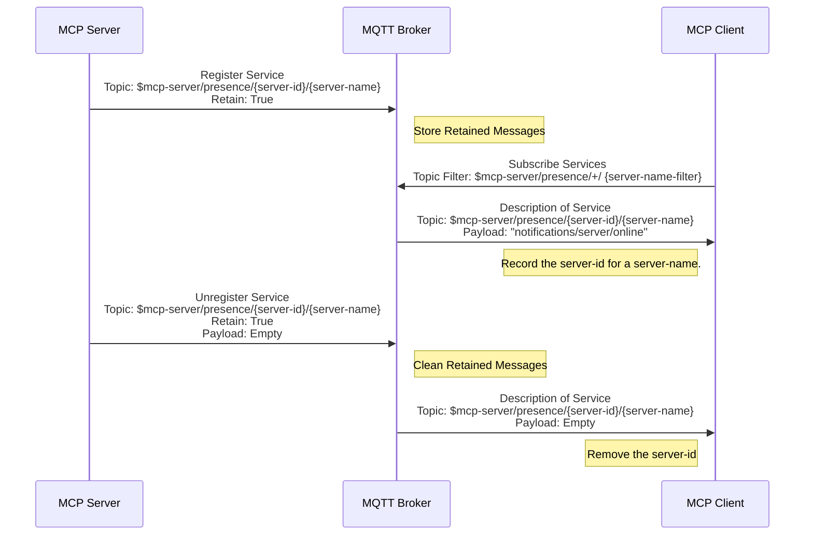
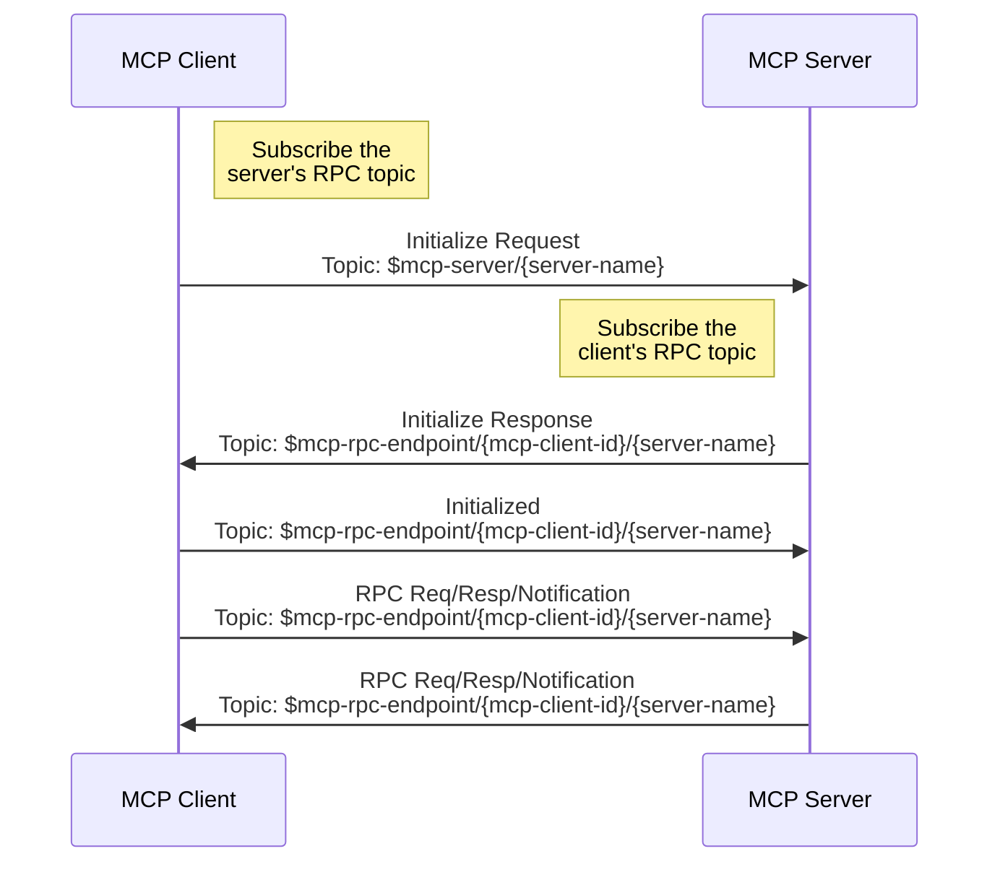
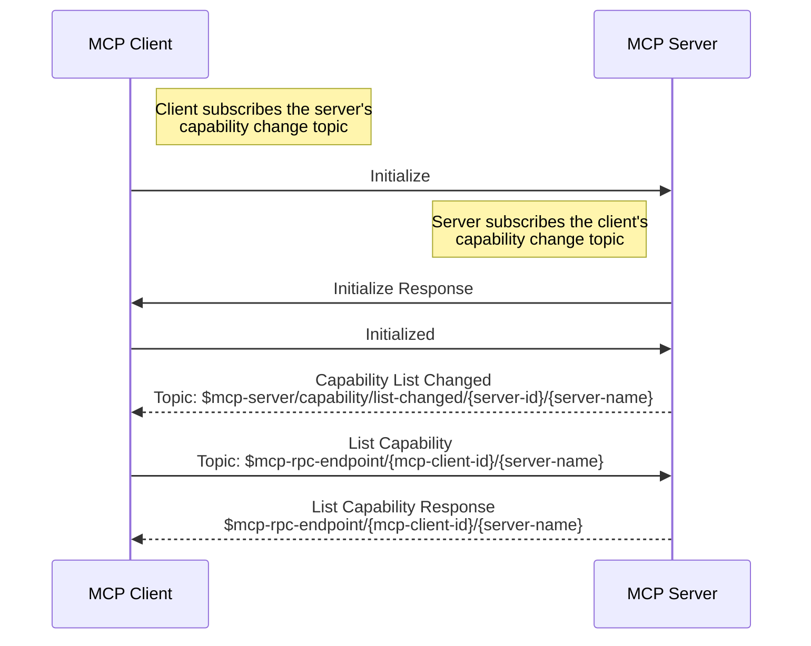
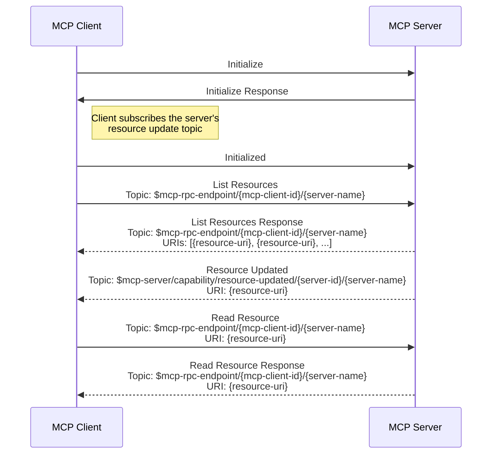

# The MQTT Transport for MCP

This specification defines the MQTT-specific requirements like MQTT topics, QoS levels, and client ID formats. It also outlines the lifecycle of the MQTT transport, including service discovery, initialization, capability list changes, resource updates, and shutdown procedures.

It should be read in conjunction with the [MCP Specification](https://spec.modelcontextprotocol.io/specification/2025-03-26/).

## Terminology

- **server-name**: The server name is the identifier of a MCP server, which will be included in the topic.

  Multiple connections with the same `server-name` are considered multiple instances of the same MCP server and provide exactly the same service. When the MCP client sends an initialize message, it should select one of them according to a client-side determined strategy.

  Multiple MCP Servers with different `server-name`s may still provide similar functions. In this case, when the client sends an initialize message, it should select one of them to establish a connection as needed. The selection criteria can be based on the client's permissions, recommendations from a LLM, or the user's choice.

  After connected to the MQTT broker, the broker may suggest a `server-name` to the MCP server by including a `MCP-SERVER-NAME` user property in the MQTT CONNECT message. If so, the MCP server **MUST** use this `server-name` as its server name. If the broker does not suggest a `server-name`, the MCP server **SHOULD** use a default `server-name` based on the functionality it provides.

  The `server-name` must be a hierarchical topic style separated by `/` so that the client can subscribe to a certain type of MCP server using MQTT topic wildcards, for example: `server-type/sub-type/name`.

  The `server-name` should not `+` and `#` characters.

  The `server-name` should be unique among all MCP servers.

- **server-name-filter**: The MQTT topic filter to match the `server-name`, it may include `/`, `+` and `#` characters. See descriptions about **server-name** for more details.

- **server-id**: The MQTT Client ID of a MCP server instance. Any string except `/`, `+` and `#`. It must be globally unique and will also be included in the topic. It is recommended to use a hex string UUID.

- **mcp-client-id**: The MQTT Client ID of the client. Any string except `/`, `+` and `#`. It must be globally unique and will be included in the topic. Each time an initialization request is made, a different client-id must be used. It is recommended to use a hex string UUID.

# MQTT Requirements and Conventions

## Message Topics

MCP over MQTT transmits messages through MQTT topics. This protocol includes the following message topics:  

| Topic Name                       | Topic Name                                                             | Description                                                                        |
|----------------------------------|------------------------------------------------------------------------|------------------------------------------------------------------------------------|
| Server's Control Topic           | `$mcp-server/{server-name}`                                          | Used for sending and receiving initialization messages and other control messages. |
| Server's Capability Change Topic | `$mcp-server/capability/list-changed/{server-id}/{server-name}`     | Used for sending and receiving server capability list changed notification.        |
| Server Resource Update Topic     | `$mcp-server/capability/resource-updated/{server-id}/{server-name}` | Used for sending and receiving server resource updated notification.               |
| Server's Presence Topic          | `$mcp-server/presence/{server-id}/{server-name}`                    | Used for sending and receiving server's online/offline status messages.            |
| Client's Presence Topic          | `$mcp-client/presence/{mcp-client-id}`                                 | Used for sending and receiving client's online/offline status messages.            |
| Client's Capability Change Topic | `$mcp-client/capability/list-changed/{mcp-client-id}`                  | Used for sending and receiving client capability list changed notification.        |
| RPC Topic                        | `$mcp-rpc-endpoint/{mcp-client-id}/{server-name}`                     | Used for sending and receiving RPC requests/responses, and notification messages.  |

## MQTT Protocol Version

The MCP server and client **MUST** use MQTT Protocol version 5.0.

## QoS

The QoS level for all PUBLISH and SUBSCRIBE messages **MUST** be 1.

## User Property

For `CONNECT` messages, the following user properties **MUST** be set:
- `MCP-COMPONENT-TYPE`: `mcp-client` or `mcp-server`.

For `CONNACK` messages sent by the broker, the following user properties **MAY** be set:
- `MCP-SERVER-NAME`: The broker suggested server name for the MCP server.
- `MCP-AUTH-ROLE`: The broker suggested role for the MCP client, which is used for a role-based access control (RBAC) mechanism.

For `PUBLISH` messages, the following user properties **MUST** be set:
- `MCP-COMPONENT-TYPE`: `mcp-client` or `mcp-server`.
- `MCP-MQTT-CLIENT-ID`: MQTT client ID of the sender.

## Session Expiry Interval

The session expiry interval **MUST** be set to 0, meaning the session will be cleaned up when the client disconnects.

## MQTT Client ID

### MCP Server

The Client ID of the MCP server can be any string except `/`, `+` and `#`, referred to as `server-id`. It is recommended to use a hex string UUID.

### MCP Client

The Client ID of the MCP Client, referred to as `mcp-client-id`, can be any string except `/`, `+` and `#`, each time an initialization request is made, a different client-id must be used. It is recommended to use a hex string UUID.

## MQTT Topics and Topic Filters

### MCP Server Subscriptions

| Topic Filter                                          | Explanation                                                                                              |
|-------------------------------------------------------|----------------------------------------------------------------------------------------------------------|
| `$mcp-server/{server-name}`                         | The control topic of the MCP server to receive control messages.                                         |
| `$mcp-client/capability/list-changed/{mcp-client-id}` | The MCP client’s capability change topic to receive capability list changed notification of the clients. |
| `$mcp-client/presence/{mcp-client-id}`                | The MCP client’s presence topic to receive the disconnected notification of the clients.                 |
| `$mcp-rpc-endpoint/{mcp-client-id}/{server-name}`    | The RPC topic to receive RPC requests, RPC responses, and notifications from a MCP client.               |

::: info
- The server **MUST** set the **No Local** option for the RPC topic (`$mcp-rpc-endpoint/{mcp-client-id}/{server-name}`) subscription to avoid receiving its own messages.
:::

### MCP Server Publications

| Topic Name                                                             | Messages                                                                                               |
|------------------------------------------------------------------------|--------------------------------------------------------------------------------------------------------|
| `$mcp-server/capability/list-changed/{server-id}/{server-name}`     | capability list changed notification.                                                                  |
| `$mcp-server/presence/{server-id}/{server-name}`                    | Presence messages for the MCP Server. <br> See [ServiceDiscovery](#service-discovery) for more details |
| `$mcp-server/capability/resource-updated/{server-id}/{server-name}` | Resource update notification.                                                                          |
| `$mcp-rpc-endpoint/{mcp-client-id}/{server-name}`                     | RPC requests, responses and notifications.                                                             |

::: info
- The server **MUST** set the **RETAIN** flag to `True` for the topic `$mcp-server/presence/{server-id}/{server-name}` when publishing the server presence message.
- When connecting to the MQTT broker, the server **MUST** set `$mcp-server/presence/{server-id}/{server-name}` as the will topic with an empty payload to clear the retain message in case of an unexpected disconnection.
:::


### MCP Client Subscriptions

| Topic Filter                                                       | Explanation                                                                                    |
|--------------------------------------------------------------------|------------------------------------------------------------------------------------------------|
| `$mcp-server/capability/list-changed/+/{server-name-filter}`     | The capability change topic to receive capability list changed notification of the MCP server. |
| `$mcp-server/capability/resource-updated/+/{server-name-filter}` | The resource update topic to receive resource update notification of the MCP server.           |
| `$mcp-server/presence/+/{server-name-filter}`                    | The presence topic to receive the presence message of the MCP server.                          |
| `$mcp-rpc-endpoint/{mcp-client-id}/{server-name-filter}`          | The RPC topic to receive PRC requests, responses and notifications sent by the MCP server.     |

::: info
- The client **MUST** set the **No Local** option for the RPC topic (`$mcp-rpc-endpoint/{mcp-client-id}/{server-name-filter}`) subscription to avoid receiving its own messages.
:::

### MCP Client Publications

| Topic Name                                            | Messages                                                           |
|-------------------------------------------------------|--------------------------------------------------------------------|
| `$mcp-server/{server-name}`                         | Send control messages like the initialize request.                 |
| `$mcp-client/capability/list-changed/{mcp-client-id}` | Send client capability list changed notification                   |
| `$mcp-client/presence/{mcp-client-id}`                | Send disconnected notification for the MCP client.                 |
| `$mcp-rpc-endpoint/{mcp-client-id}/{server-name}`    | The RPC topic to send RPC requests/responses to a specific server. |

::: info
- When connecting to the MQTT broker, the client **MUST** set `$mcp-client/presence/{mcp-client-id}` as the will topic with a "disconnected" notification as the payload to notify the server in case of an unexpected disconnection.
:::

# Lifecycle of MQTT Transport

## Service Discovery

### Service Registration

After the MCP server starts, it registers its service with the MQTT broker. The presence topic for service discovery and registration is: `$mcp-server/presence/{server-id}/{server-name}`.

The MCP server **MUST** publish a "server/online" notification to the service presence topic when they start, with the **RETAIN** flag set to `True`.

The "server/online" notification **SHOULD** provide only limited information about the server to avoid the message size being too large. The client can request more detailed information after initialization.

- A brief description of the MCP server's functionality to help clients determine which MCP servers they need to call.
- Some metadata, such as hints about the permissions required to access this MCP server, to help clients quickly assess whether they have access.

```json
{
  "jsonrpc": "2.0",
  "method": "notifications/server/online",
  "params": {
      "server_name": "example/server",
      "description": "This is a brief description about the functionalities provided by this MCP server to allow clients to choose as needed. If tools are provided, it explains what tools are available but does not include tool parameters to reduce message size.",
      "meta": {
        // Any metadata, such as hints about the permissions required to access this MCP server
        "authorization": {
          "roles": ["admin", "user"]
        }
      }
  }
}
```

More detailed information, such as parameter details of the tools, **SHOULD** only be fetched by the client when needed, by sending `**/list` requests to the server.

The client can subscribe to the `$mcp-server/presence/+/{server-name-filter}` topic at any time, where `{server-name-filter}` is a filter for the server name.

For example, if the server name is `{server-type}/{sub-type}/{name}`, and the client determines through its permissions that it can only access MCP servers of type `{server-type}/{sub-type}`, it can subscribe to `$mcp-server/presence/+/{server-type}/{sub-type}/#`, thereby subscribing to the service presence topic for all MCP servers of the `{sub-type}` type at once.

Although the client can subscribe to `$mcp-server/presence/+/#` to get all types of MCP servers, the administrator might restrict it through ACL (Access Control List) on the MQTT broker to only send and receive messages on RPC topics like `$mcp-rpc-endpoint/{mcp-client-id}/{server-type}/{sub-type}/#`. Therefore, subscribing to overly broad topics is not useful. By designing the `{server-name-filter}` appropriately, the client can reduce interference from irrelevant information.

### Service Unregistration

When connecting to the MQTT broker, the server must set `$mcp-server/presence/{server-id}/{server-name}` as the will topic, with an empty payload will message, to clear the registration information in case of an unexpected disconnection.

Before actively disconnecting from the MQTT broker, the server **MUST** send an empty payload message to the `$mcp-server/presence/{server-id}/{server-name}` topic to clear the registration information.

On the `$mcp-server/presence/{server-id}/{server-name}` topic:

- When the client receives a `server/online` notification, it should record the `{server-id}` as one of the instances of that `{server-name}`.
- When the client receives an empty payload message, it should clear the cached `{server-id}`. As long as any instance of that `{server-name}` is online, the client should consider the MCP server to be online.

The message flow for service registration and unregistration is as follows: 



## Initialization

This section only describes the MQTT transport specific parts of the initialization phase, please see [Lifecycle](https://spec.modelcontextprotocol.io/specification/2025-03-26/basic/lifecycle/#initialization) for more details.

The initialization phase **MUST** be the first interaction between client and server.

The client **MUST** subscribe to the RPC topic (`$mcp-rpc-endpoint/{mcp-client-id}/{server-name}`) before sending the initialization request, with the **No Local** subscription option.

The server **MUST** subscribe to the RPC topic (`$mcp-rpc-endpoint/{mcp-client-id}/{server-name}`) before responding to the initialization response, with the **No Local** subscription option.



The client **MUST** initiate this phase by sending an `initialize` request to the topic `$mcp-server/{server-name}` containing:

- Protocol version supported
- Client capabilities
- Client implementation information

```json
{
  "jsonrpc": "2.0",
  "id": 1,
  "method": "initialize",
  "params": {
    "protocolVersion": "2024-11-05",
    "capabilities": {
      "roots": {
        "listChanged": true
      },
      "sampling": {}
    },
    "clientInfo": {
      "name": "ExampleClient",
      "version": "1.0.0"
    }
  }
}
```

The server **MUST** respond with its own capabilities to the topic `$mcp-rpc-endpoint/{mcp-client-id}/{server-name}` and information:

```json
{
  "jsonrpc": "2.0",
  "id": 1,
  "result": {
    "protocolVersion": "2024-11-05",
    "capabilities": {
      "logging": {},
      "prompts": {
        "listChanged": true
      },
      "resources": {
        "subscribe": true,
        "listChanged": true
      },
      "tools": {
        "listChanged": true
      }
    },
    "serverInfo": {
      "name": "ExampleServer",
      "version": "1.0.0"
    }
  }
}
```

After successful initialization, the client **MUST** send an initialized notification to indicate it is ready to begin normal operations, to the topic `$mcp-rpc-endpoint/{mcp-client-id}/{server-name}`:

```json
{
  "jsonrpc": "2.0",
  "method": "notifications/initialized"
}
```

## Capability List Changed

Before initiating the Initialize request, the MCP client **MUST** subscribe to the MCP server's capability list changed topic: `$mcp-server/capability/list-changed/+/{server-name-filter}`, where `{server-name-filter}` is a filter for the server name.

For example, during the service discovery phase, if a MCP server named `{server-type}/{sub-type}/{name}` is available, the client can subscribe to `$mcp-server/capability/list-changed/+/{server-type}/{sub-type}/#`, thereby subscribing to the capability list changed topic for all MCP servers of the `{sub-type}` type at once.

Before the MCP server responds to the initialization request, it **MUST** first subscribe to the MCP client's capability list changed topic: `$mcp-client/capability/list-changed/{mcp-client-id}`.

If there are subsequent capability list updates:

- The server will send a notification to: `$mcp-server/capability/list-changed/{server-id}/{server-name}`
- The client will send a notification to: `$mcp-client/capability/list-changed/{mcp-client-id}`

The payload of the capability list changed notification depends on the specific capability that has changed. For example "notifications/tools/list_changed" for tools. After receiving a capability list change notification, the client or server needs to retrieve the updated capability list. See the specific capability documentation for details.



## Resource Update

The MCP protocol specifies that the client can subscribe to changes of a specific resource.

If the server provides the capability to subscribe to resources, the client can subscribe to the resource changes before sending the initialized notification.

The topic for the client to subscribe to resource changes is: `$mcp-server/capability/resource-updated/{server-id}/{server-name}`.

When a resource changes, the server **SHOULD** send a notification to `$mcp-server/capability/resource-updated/{server-id}/{server-name}`.



## Shutdown

### Server Disconnect

The server **MUST** connect with a will message to notify the client when it disconnects unexpectedly, the will topic is `$mcp-server/presence/{server-id}/{server-name}` and the payload is empty.

Before a server disconnects, the server **MUST** send a empty message to the topic `$mcp-server/presence/{server-id}/{server-name}`.

When the client receives the empty message on this topic, **MUST** disconnect and **MAY** send another initialization request using a different client-id.

### Client Disconnect

The server **MUST** subscribe to the client's presence topic (`$mcp-client/presence/{mcp-client-id}`) before sending the initialization response.

The client **MUST** connect with a will message to notify the server when it disconnects unexpectedly, the will topic is `$mcp-client/presence/{mcp-client-id}` and the payload is a "disconnected" notification.

Before the client disconnects, it **MUST** send a "disconnected" notification to the topic `$mcp-client/presence/{mcp-client-id}`.

After the server receives the "disconnected" notification, it **MUST** unsubscribe the `$mcp-rpc-endpoint/{mcp-client-id}/{server-name}` topic.

The message format for the client's "disconnected" notification is:

```json
{
  "jsonrpc": "2.0",
  "method": "notifications/disconnected"
}
```

## Health Checks

The client or the server **MAY** send `ping` requests to the server at any time to check the health of their counterpart.

- If the client does not receive a `ping` response from the server within a reasonable time, it **MUST** send a "disconnected" notification to the topic `$mcp-client/presence/{mcp-client-id}` and disconnect itself.
- If the server does not receive a `ping` response from the client within a reasonable time, it **MUST** send any other PRC requests to the client.

For more information, see [Ping](https://spec.modelcontextprotocol.io/specification/2025-03-26/basic/utilities/ping/).

## Timeouts

All RPC requests are sent asynchronously via MQTT messages, so timeout issues need to be considered. The timeout duration may vary for different RPC requests, but it should be configurable.

Below are the recommended default timeout values for each type of RPC request in this protocol:

- "initialize": 30 seconds
- "ping": 10 seconds
- "roots/list": 30 seconds
- "resources/list": 30 seconds
- "tools/list": 30 seconds
- "prompts/list": 30 seconds
- "prompts/get": 30 seconds
- "sampling/createMessage": 60 seconds
- "resources/read": 30 seconds
- "resources/templates/list": 30 seconds
- "resources/subscribe": 30 seconds
- "tools/call": 60 seconds
- "completion/complete": 60 seconds
- "logging/setLevel": 30 seconds

<!-- {< callout type="info" >}
Progress requests are sent as notifications and do not require a response, so no timeout is needed.
{< /callout >} -->

## Error Handling

Implementations **SHOULD** be prepared to handle these error cases:

- Protocol version mismatch
- Failure to negotiate required capabilities
- Initialize request timeout
- Shutdown timeout

Implementations **SHOULD** implement appropriate timeouts for all requests, to prevent
hung connections and resource exhaustion.

Example initialization error:

```json
{
  "jsonrpc": "2.0",
  "id": 1,
  "error": {
    "code": -32602,
    "message": "Unsupported protocol version",
    "data": {
      "supported": ["2025-03-26"],
      "requested": "1.0.0"
    }
  }
}
```
