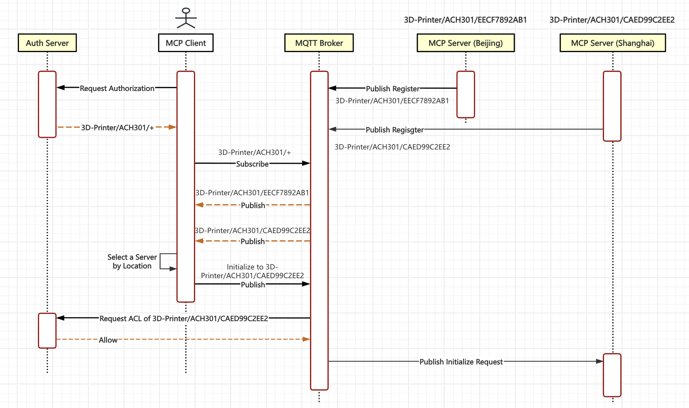
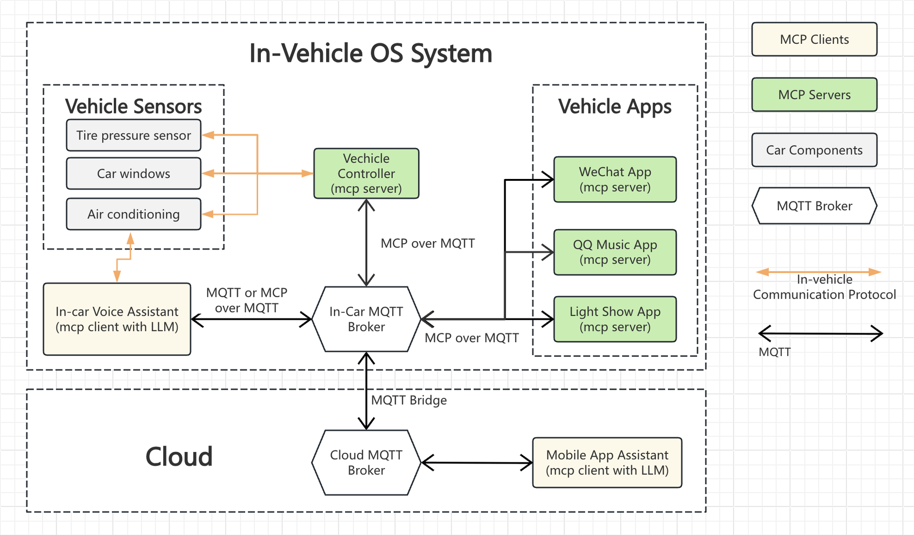
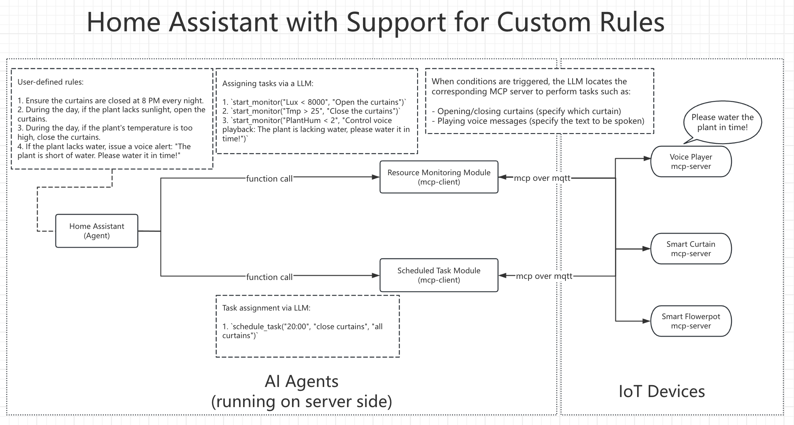

# Use Cases

Although most of the examples here are from the IoT industry, MCP over MQTT is not limited to the IoT domain — it is suitable for any scenario that requires remote access to an MCP server, especially in the following cases:

- If your system is using the MQTT protocol, or you intend to adopt MQTT.
- If you need the protocol's built-in capability to automatically discover MCP servers.
- If you require a message broker rather than building an HTTP API gateway to manage a large number of MCP servers.
- If you want to handle authentication, authorization, rate limiting, and similar concerns at the message broker.
- If you wish to launch multiple dynamically scalable instances of a stateful MCP server and have the message broker automatically route messages to the appropriate server instance.
- If you’re developing an IoT device that communicates using the MQTT protocol for M2M scenarios, but you don’t want to bother with designing topic hierarchies or handling connection management, subscriptions, and message transmission yourself.

## Use Cases for M2M

If you're developing an M2M IoT device that communicates using the MQTT protocol, using a traditional MQTT SDK requires you to manually handle connection management, subscriptions, message sending and receiving, as well as carefully design topic hierarchies and other details.

But now, by using the MCP over MQTT SDK, all of that is taken care of for you. You can focus on writing logic related to resources and tool invocation.

MCP over MQTT is particularly well-suited for M2M use cases. The *resources*, *tools*, and *resource subscription* mechanisms defined by the MCP protocol are quite similar to the *resource*, *object*, and *observe/notify* concepts in the LwM2M protocol. Compared to LwM2M, MCP over MQTT has the following major differences:

- MCP over MQTT is designed for accessing resources and tools using large models in AI systems, while LwM2M is designed for efficient access to resource-constrained devices, featuring comprehensive capabilities such as device management, data modeling, and remote firmware updates.

- MCP does not define a device data model — it only requires exposing *resources* and *tools*. In contrast, LwM2M requires a predefined data model configured on the server using XML.

- MCP over MQTT uses TCP, which is more friendly for systems behind NAT gateways and firewalls. It avoids message loss caused by connection tracking timeouts. However, unlike LwM2M, MCP over MQTT requires maintaining a long connection, which increases the load on the device side.

- MCP over MQTT is a much simpler protocol, but also offers fewer features.

LwM2M uses CoAP at its core, where the CoAP server actually runs on the device. Similarly, in M2M scenarios, the MCP server also runs on the device.

Device manufacturers can embed fully functional MCP servers within their devices, including suggested prompts and other capabilities. This way, IoT platforms purchasing these devices don’t need to develop access and control code for each device model individually. Instead, they can access all devices through a unified intelligent client. This is the "standardization" benefit brought by MCP.

### 3D Printers

This example demonstrates how MCP over MQTT handles MCP client authentication and how the MCP client uses topic wildcards to filter MCP servers.

Suppose there are two 3D printers, each providing an MCP server, with their server names designed as a hierarchical structure:

- `3D-Printer/ACH301/EECF7892AB1`: This printer is in Beijing  
- `3D-Printer/ACH301/CAED99C2EE2`: This printer is in Shanghai

Here, `3D-Printer/ACH301/` represents the hierarchical device type, and `EECF7892AB1` and `CAED99C2EE2` are the device IDs. Although the server names of the two devices are different, they actually provide identical printing services, just in different geographical locations. When both printers are started, the location information should be registered as metadata along with the service registration to the MQTT broker.

First, in the authentication center, we centrally set up the corresponding printer permissions for each user and provide an HTTP API for external access. After logging in, the client (such as a mobile app) needs to query the user's permissions. We assume that the user is only allowed to access printers of type `ACH301`, and the MQTT broker's ACL rules also restrict the user to access only topics related to `3D-Printer/ACH301/+`.

Then, the client subscribes to `3D-Printer/ACH301/+` to retrieve all available server names for the current user of the app, so it will receive two available printers (MCP servers): `EECF7892AB1` and `CAED99C2EE2`. The client first determines which printer to use based on the current location of the mobile app, and then selects the nearest printer to initialize the MCP connection.

Now, if the user issues the command: "Print my toy model", the client will invoke the LLM to determine the function and parameters to execute, and then call the corresponding printer to perform the print task.

### Using MQTT as the Communication Protocol for Intelligent Car Systems

Nowadays, new energy vehicles are equipped with voice assistants, which use LLM embedded in the car’s system. These assistants can access various functions within the car, such as displaying tire pressure, controlling air conditioning, windows, and more. The process is shown in the diagram below, where the yellow arrows represent the in-car communication network, and the voice assistant accesses sensors directly through this network.

The problem with current in-car voice assistants is that while users can open specific applications, accessing the internal functions of these applications is relatively difficult. For instance, the assistant can easily open WeChat, but sending a message or making a voice call to someone is more complicated. Some systems attempt to partially solve this by using the LLM to read the screen. The user first gives a voice command to open WeChat, and the system analyzes the on-screen text to help click the right button. However, this solution is not direct, and in more complex interfaces, it can be difficult to find the desired function.

These are the issues that MCP aims to address. If MCP can become the standard protocol for how LLMs access tools, most applications will provide quick access interfaces in the form of MCP servers, allowing the in-car voice assistant to operate these applications more accurately. For example, WeChat could offer interfaces for sending messages or making voice calls, and QQ Music could provide an interface for playing music of a certain style.

There is a need for communication between in-car applications and the voice assistant, as well as between in-car applications and mobile apps. Even mobile apps can directly send instructions to the voice assistant in the car.

Our suggestion here is to set up an MQTT broker inside the car and bridge it with the cloud MQTT broker, thus enabling the entire cloud-car intelligent communication system:

- Inside the car, the voice assistant accesses in-car software using the MCP protocol through the built-in MQTT broker, such as WeChat.

- On the mobile side, mobile applications can access in-car software using the MCP protocol through the cloud MQTT broker, such as the light show program.

### Agentic App in Smart Homes

Suppose we have several smart devices in my home, each from different manufacturers. How can we integrate them to create a "Smart Home" system that supports custom rules? If device manufacturers have installed the MCP over MQTT server SDK on their devices, integrating them into a whole system becomes very easy.

Assume a user has the following three devices in their home:

- Voice player: Its function is to receive a text and play it back as speech.
- Smart curtain controller: It can control the opening and closing of a curtain.
- Electronic flower pot: It has built-in temperature, soil moisture, and light sensors.

As long as these devices implement the MCP server, building a "Agent Orchestration Platform" becomes very easy. For example, the user can define the following rules in the smart home system:

- Every night at 8 PM, ensure the curtains are closed.
- During the day, if the plant doesn't get enough sunlight, open the curtains.
- During the day, if the plant's temperature is too high, close the curtains.
- If the plant is out of water, send a voice notification: "The plant is out of water, please water it!"

Our system consists of three components:

- **Home Assistant Agent**: Responsible for invoking a large language model to interpret user-defined rules, then assigning tasks to the appropriate modules.

- **Resource Monitoring Module**: This module serves both as a Function (used by the large language model’s function-calling capability) and as an MCP client. The MCP protocol defines how an MCP client subscribes to resource updates from MCP servers. When a resource change occurs, the module evaluates conditions and executes the corresponding task if conditions are met.

- **Scheduled Task Module**: Similarly, this module functions both as a Function (for the large language model to call) and as an MCP client. When a timer is triggered, it performs the assigned task.

The Home Assistant breaks down tasks and distributes them to the Resource Monitoring and Scheduled Task modules. The decomposed tasks are still described in natural language, so when a condition is met, both modules need to call the large language model again to determine which device to control.

MCP standardizes operation modes, making it easy for devices from any manufacturer to integrate into a unified agent platform.
